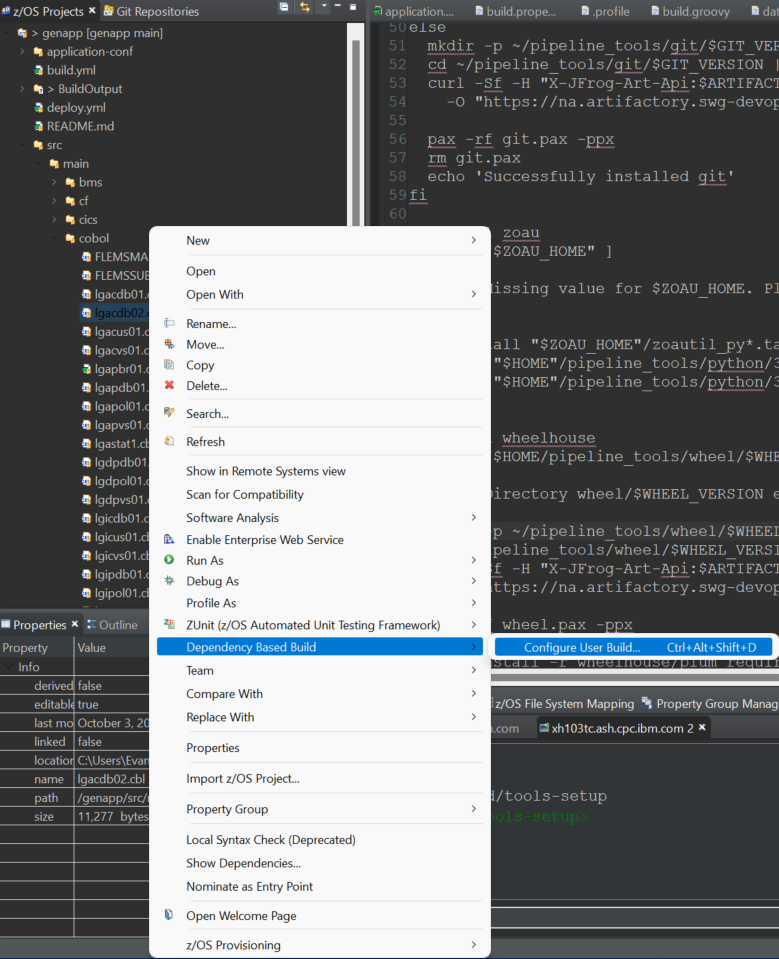
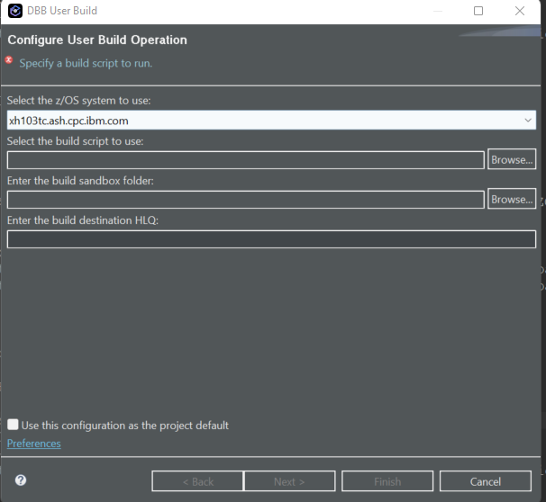
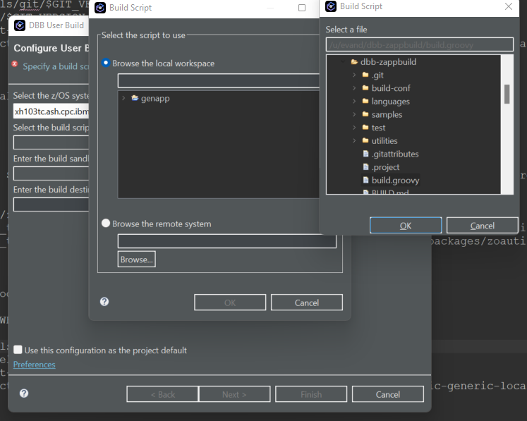
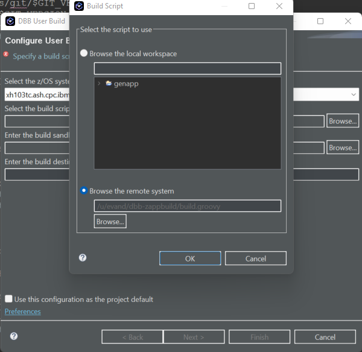
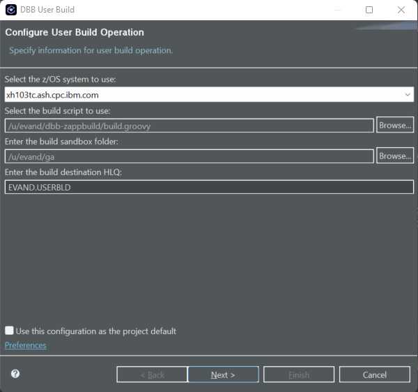
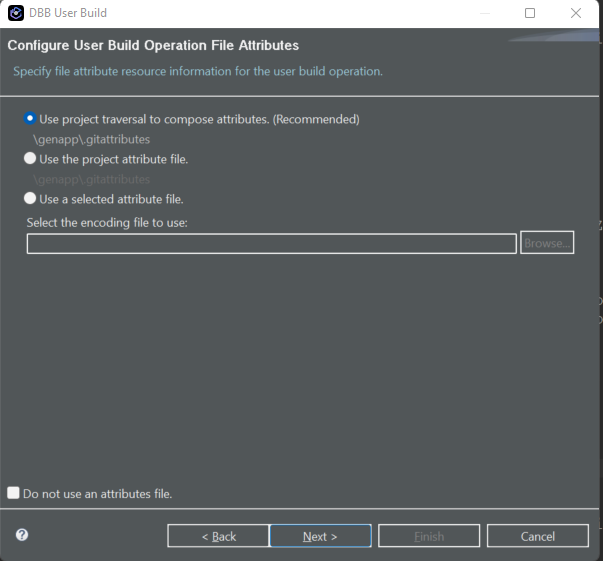
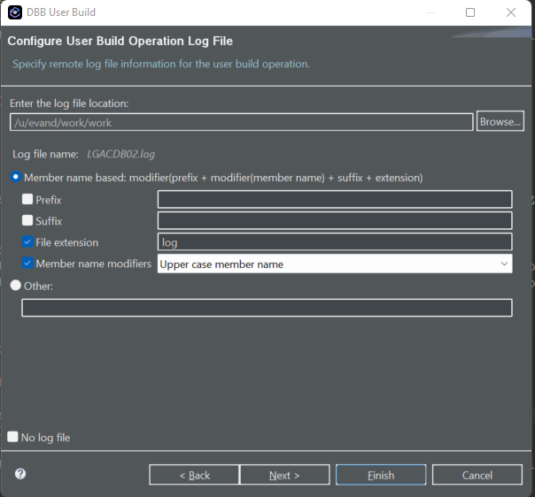
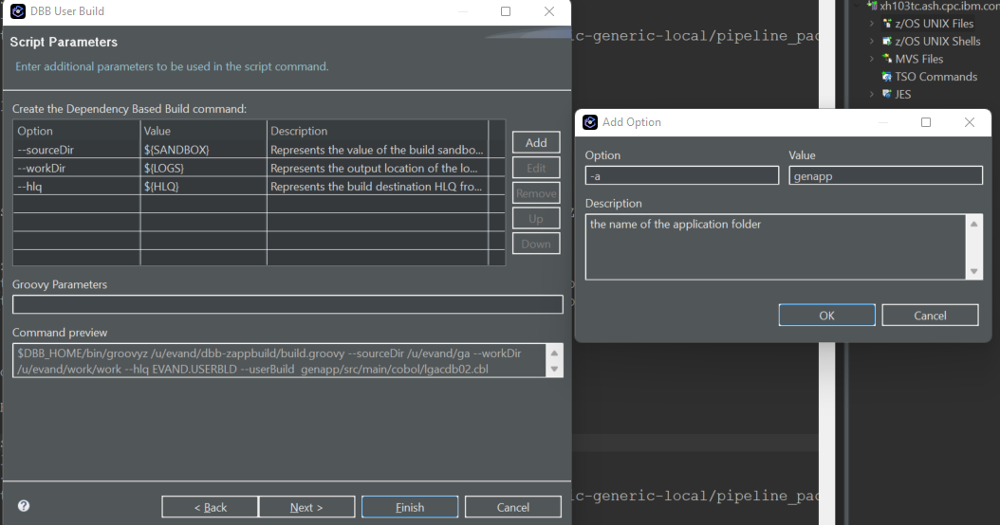
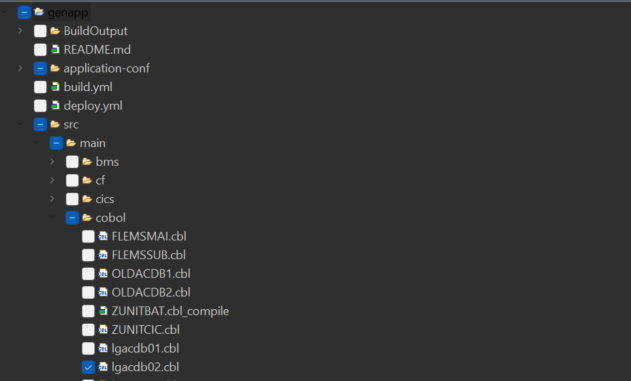
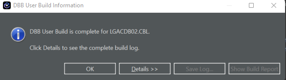

# Guide: Performing DBB User Build in IDz

By the end of this guide, you should be able to perform a User Build in IDz. Your application will be compiled and link edited on your target z/OS environment. (Note: This guide is for users who need DBB without all the other pipeline tools.)

## Before getting started: 
Curl must be installed. Check this by typing "curl" in your USS terminal. You also must have an API token generated in artifactory.

Make sure DBB is installed on the target LPAR using the DBB installation script: https://github.ibm.com/CIO-zOS-Pipelines/tools-setup/blob/main/install-dbb.sh

## Step 1: Configure .profile file
```bash
# DBB setup
export DBB_HOME=~/dbb-2.0
export GROOVY_HOME=$DBB_HOME/groovy-2.4.12
export DBB_CONF=$DBB_HOME/conf
export CLASSPATH=$DBB_CONF
export PATH=$DBB_HOME/bin:$GROOVY_HOME/bin:$DBB_HOME/bin:$JAVA_HOME/bin:$PATH
```
## Step 2: Locate your application in z/OS Projects panel
Right click on any cobol program and select “Dependency Based Build/Configure User Build”.


## Step 3: Enter Your z/OS host DNS or IP


## Step 4: Select a Build Script
 For “Select the build script ...” and “...sandbox...”, press the “Browse” on the right of each field to navigate the remote USS filesystem and select the path for “/dbb-zappbuild/build.groovy.” For the build sandbox folder, select a location for the build log files to go. Click ok.


 

 ## Step 5: Finish Configure User Build Operation
 The value for “Enter the log file ...” is auto filled and needs no change. “HLQ” - enter your z/OS ID. Click next.


 ## Step 6: Confirm Log FIle Info
On the Configure User Build Operation File Attributes page, click "Next. Then, from the Configure User Build Operation Log File menu, click "Next" again.



 ## Step 6: Edit Options for User Build Command
 Click “ADD” to enter the Option “-a” with a value of “your-application-name” and then “OK.”


## Step 6: Select Additional Files to Load
Press “Next” and on the next page select the “application-conf” folder (you only need to do this the first time or any time you change something in this folder). All other folder(s) are pre-selected.



## Step 6: Initiate User Build
Press Finish to start a DBB user build. Within a few seconds, IDz will display the results. Press details to view the compiler/link output. If a system
error is returned, double check your settings and MVS privileges and try again.

