# DayInTheLife - Coding with IBM Developer for z Systems® (IDz)

Dependency Based Build (DBB) is an intelligent build technology that is used in a DevOps pipeline for building Mainframe applications. IBM Developer for z Systems® (IDz) with DBB is used in a DevOps pipeline along with an open source tool stack such as Git, Jenkins and Artifactory. While Git, Jenkins and Artifactory are used across the enterprise, DBB fills the gap to provide a build framework for mainframe objects.

We can use DBB user build through IDz to perform a quick single program compile and link on z/OS. Without DBB, you must manually allocate data sets to create a partitioned datasets with error-prone datasets configurations. Without DBB, you also compile, link, load manually by building appropriate Job Control Language.
DBB handles all this error-prone steps and you will comfortably build all - coding, compile, link, and load.

Please refer to IBM Developer for z/OS documentation (https://www.ibm.com/docs/en/developer-for-zos/16.0?topic=perspective-zos-projects-view)

## Step 1: Create a new COBOL Program 

We will use the  z/OS Projects view to work with local and remote z/OS® projects and MVS™ and z/OS UNIX subprojects.
From IDz, the left upper panel displays z/OS Project view to access local datasets offline. In our example, we will create a new COBOL file from /src/main/cobol folder.

From the z/OS Projects view, select src/main/cobol folder and navigate New -> File.

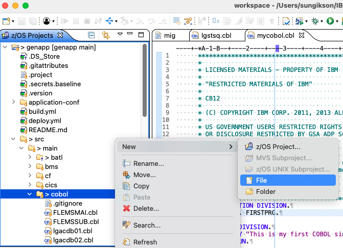

we created a COBOL program file called mycobol.cbl

```
   
       IDENTIFICATION DIVISION.
       PROGRAM-ID. FIRSTPRG.

       PROCEDURE DIVISION.
           DISPLAY "This is my first COBOL since 1985 !!".
           STOP RUN.

```
## Step 2: Configure Dependency Based User Build 

Select the program file we just made and right click -> Dependency Based Build -> Configure User Build ...

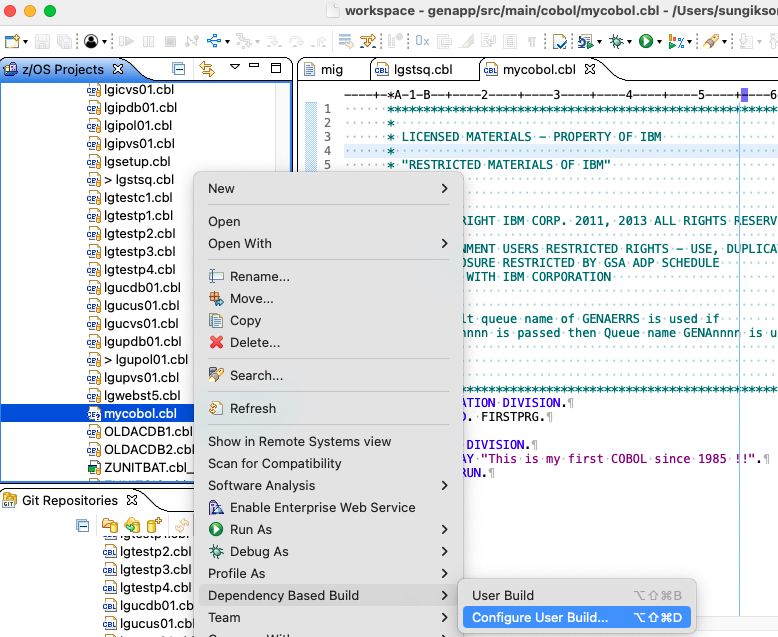

Enter your z/OS system, build script, sandbox folder, and HLQ destination name.
In this example we use username.NEW.


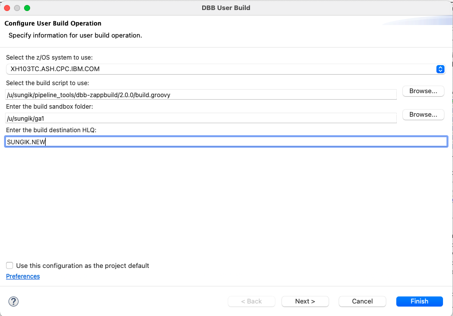

## Step 3: Execute Dependency Based User Build 

Select the program file we just made and right click -> Dependency Based Build -> User Build


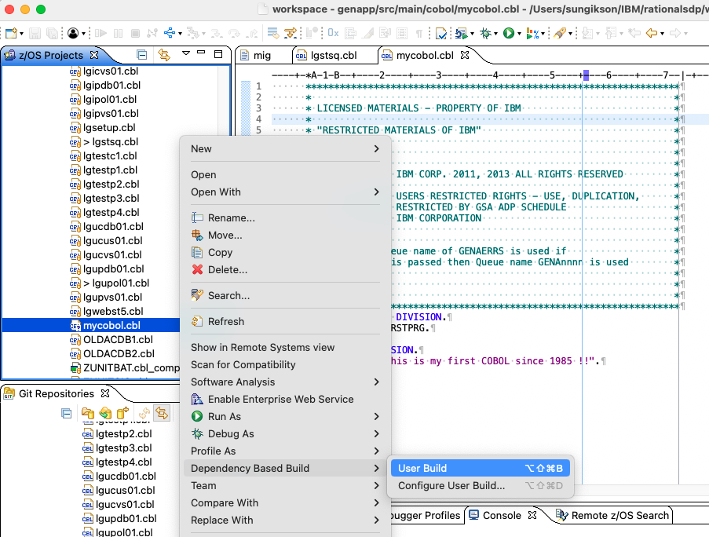

You can see the build status from the Console.

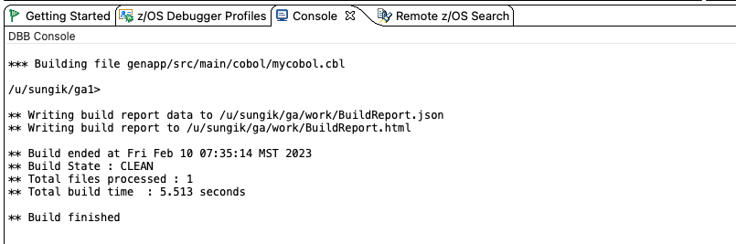

## Step 4: Dependency Based User Build log

The DBB build report contains summary information of the build commands executed during the build. The DBB build report is basically a collection of records, each of which contain information about a build command that was executed during the build. These records are automatically created and added to the build report when the command is executed.


You now can view the Build Report.


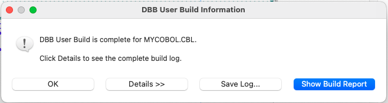

Click "Show Build Report" button to view the Build Report.

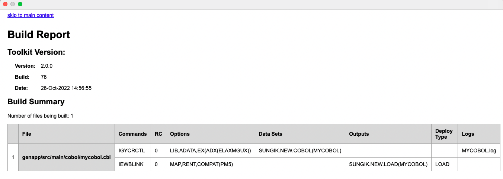

## Step 5: Remote System View to access z/OS system


The top upper right panel displays the remote system which is zOS.
You now see SUNGIK.NEW.COBOL, SUNGIK.NEW.COPY, SUNGIK.NEW.DBRM, SUNGIK.NEW.OBJ, and SUNGIK.NEW.LOAD dataset.


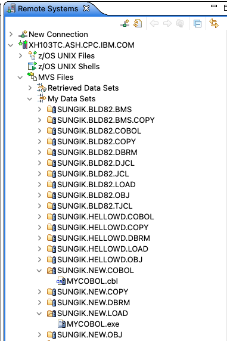

You can view the member of SUNGIK.NEW.COBOL dataset.

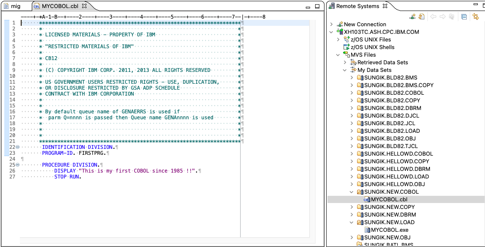

## Step 6: Create a JCL to execute the program

Job Control Language(JCL) is used to tell the operating system what to do such as what program to execute along with a mechanism for the program to read input and write output.

From the z/OS Projects view, select src/jcl folder and New -> File.

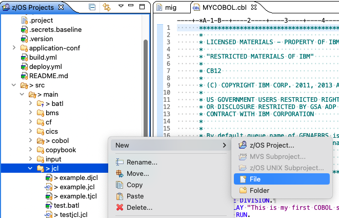

Create a JCL file called "newprg.jcl".

```
//SUNGIK JOB 'WD-PKGBIND',MSGLEVEL=(1,1),MSGCLASS=R,NOTIFY=&SYSUID
//*
//* PRINT "HELLO WORLD" ON JOB OUTPUT
//*
//* NOTE THAT THE EXCLAMATION POINT IS INVALID EBCDIC FOR JCL
//*   AND WILL CAUSE A JCL ERROR
//*
//RUN EXEC PGM=MYCOBOL
//STEPLIB  DD DISP=SHR,DSN=SUNGIK.NEW.LOAD
//SYSIN    DD DUMMY
//SYSPRINT DD SYSOUT=*
//SYSUT1   DD *
//SYSUT2   DD SYSOUT=*
```

You will configure DBB User Build Operation using the same HLQ: SUNGIK.NEW.
When you execute DBB User Build, you will see the Console log from the Console window.

```
** Build start at 20230210.081446.014
/u/sungik/ga1>

** Build output located at /u/sungik/ga/work
** Adding genapp/src/main/jcl/newprg.jcl to Building build list

** Writing build list file to /u/sungik/ga/work/buildList.txt
** Populating file level properties from individual property files.
** Invoking build scripts according to build order: BMS.groovy,MFS.groovy,Cobol.groovy,Assembler.groovy,PLI.groovy,LinkEdit.groovy,DBDgen.groovy,PSBgen.groovy,Transfer.groovy

** Building files mapped to Transfer.groovy script
*** Transferring file genapp/src/main/jcl/newprg.jcl
** Writing build report data to /u/sungik/ga/work/BuildReport.json
** Writing build report to /u/sungik/ga/work/BuildReport.html
** Build ended at Fri Feb 10 08:14:47 MST 2023
** Build State : CLEAN
** Total files processed : 1
** Total build time  : 0.914 seconds

** Build finished

/u/sungik/ga1>
```

You now can see new dataset SUNGIK.NEW.JCL is created with member NEWPRG.

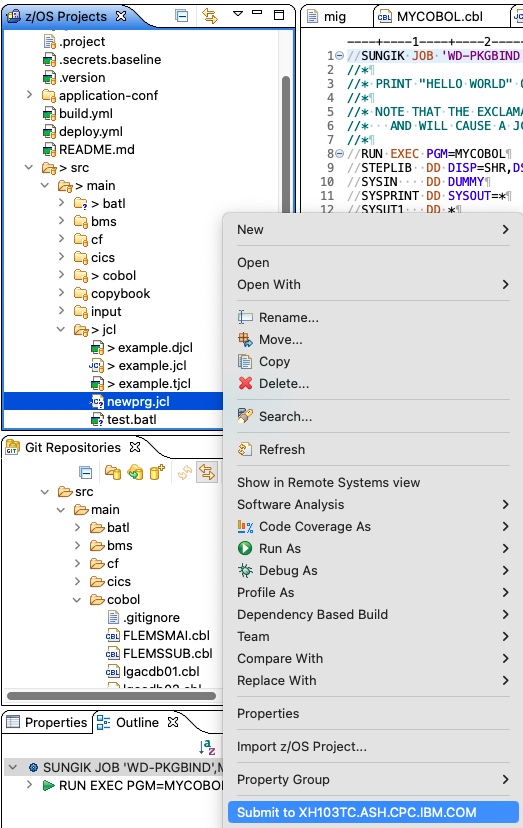

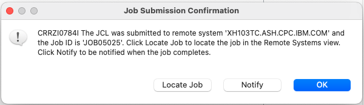

## Step 7: Verify JCL Submission


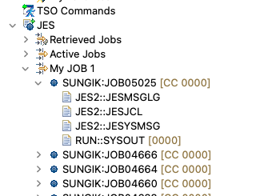

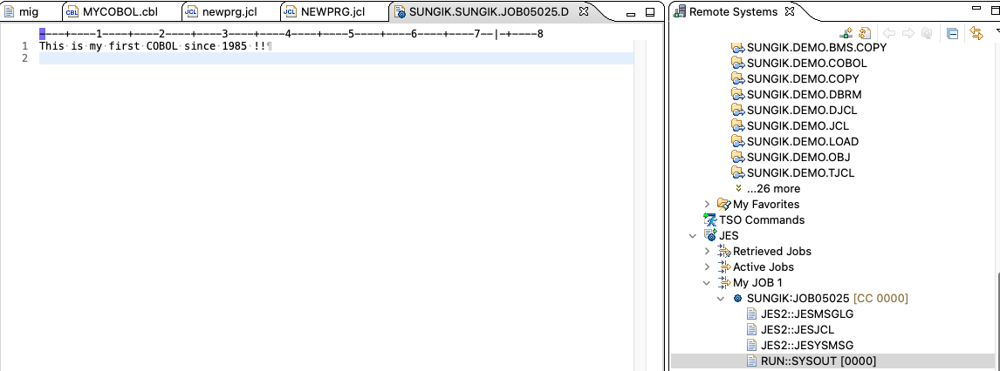


