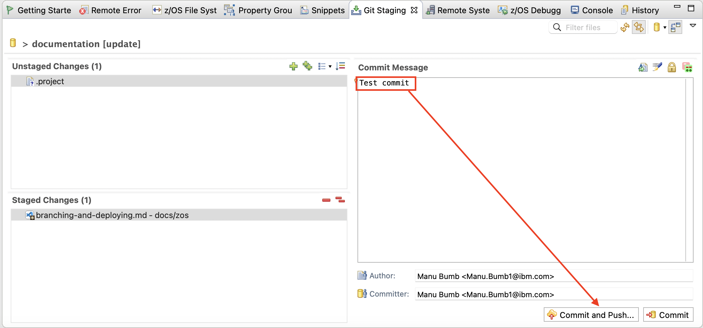
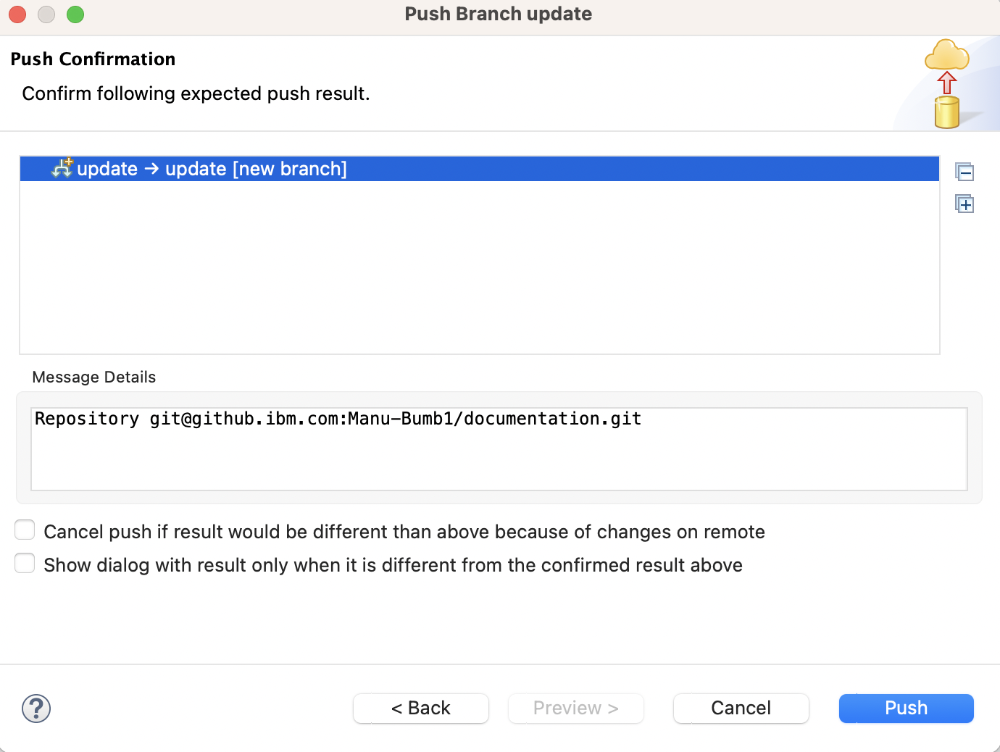

# Day In The Life of a z/OS Developer - Commit and Push to GitHub

After you've finished making your changes, you'll need to commit them to your branch, and push them to github.

## Commit and Push

After saving your changes and IDz, the updated files will appear in the Git Staging tab at the bottom of IDz.

For this next step, it might be helpful to enlage the bottom frame by clicking and dragging on the top border.

Your changes will need to be staged - this can be done by selecting the desired files and clicking the single green plus button, or by clicking the double green plus button to stage all unstaged files.

After your changes are staged, type a commit message, and press the Commit and Push button.

After pressing the Commit and Push button, if this is your first time pushing this branch, you'll see a Push Branch window - click the Preview button. (if this isn't your first time pushing this branch, you'll see the Push Results window instead)

The next screen will ask you to confirm the expected push result, showing that your local branch will be pushed to the remote repository.  If that looks right, press the Push button to finish pushing your changes.

After the push has completed, you'll see one final Push Results screen.

Now your changes are in github, where a Pull Request can be made.
