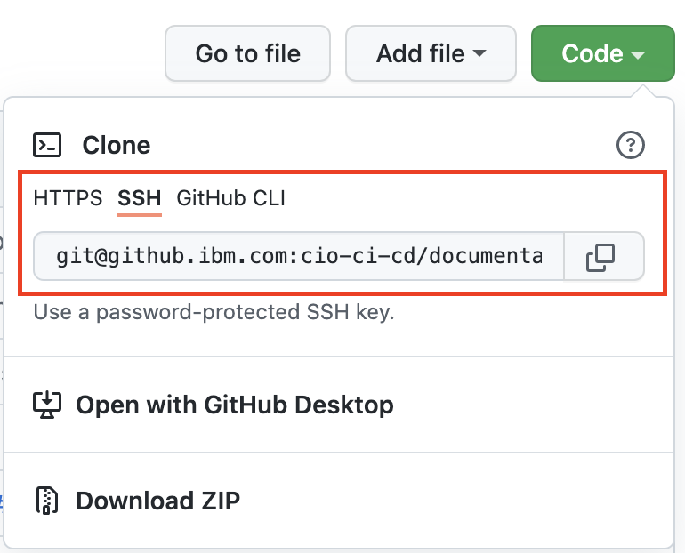
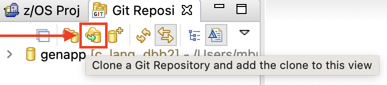
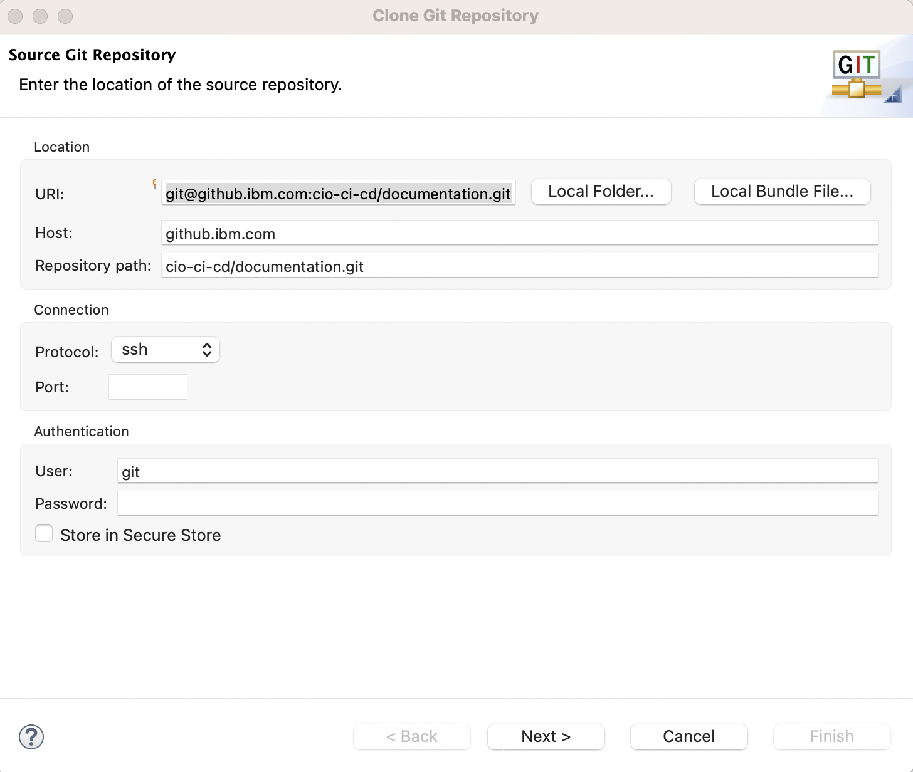
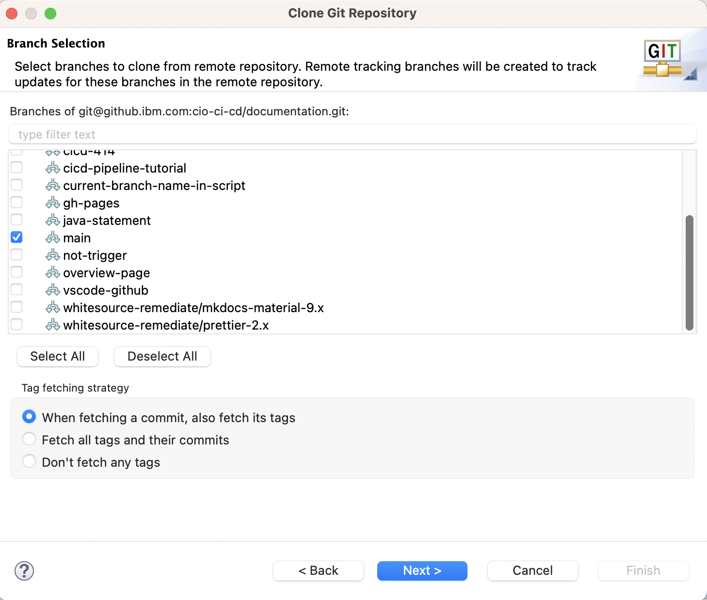
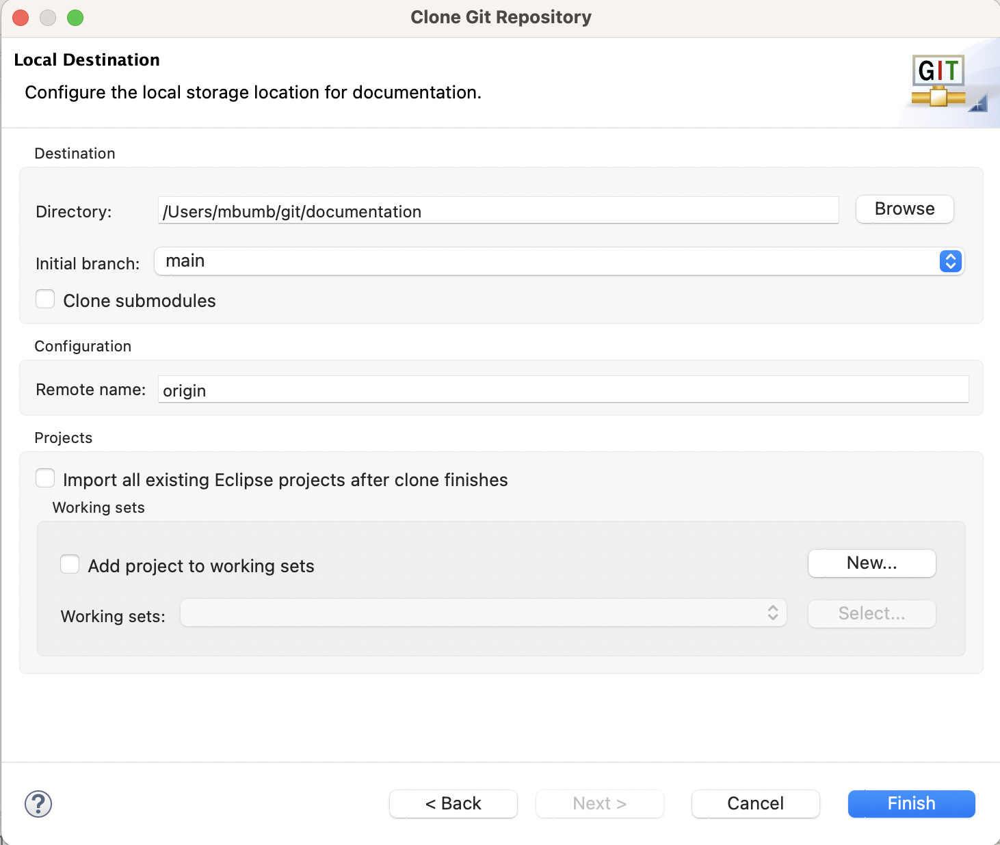
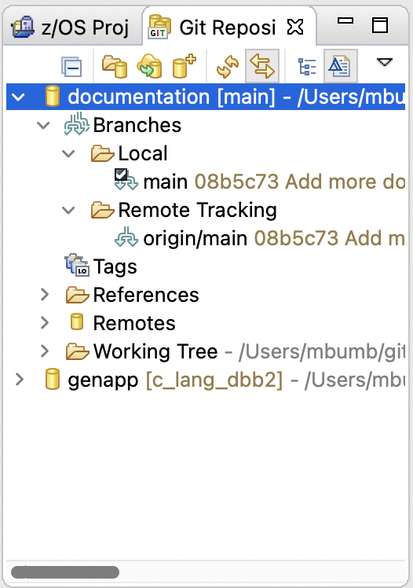
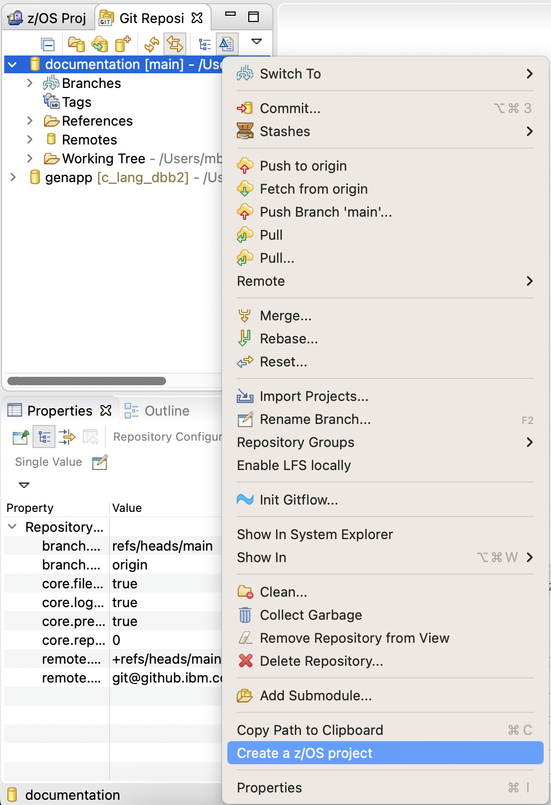
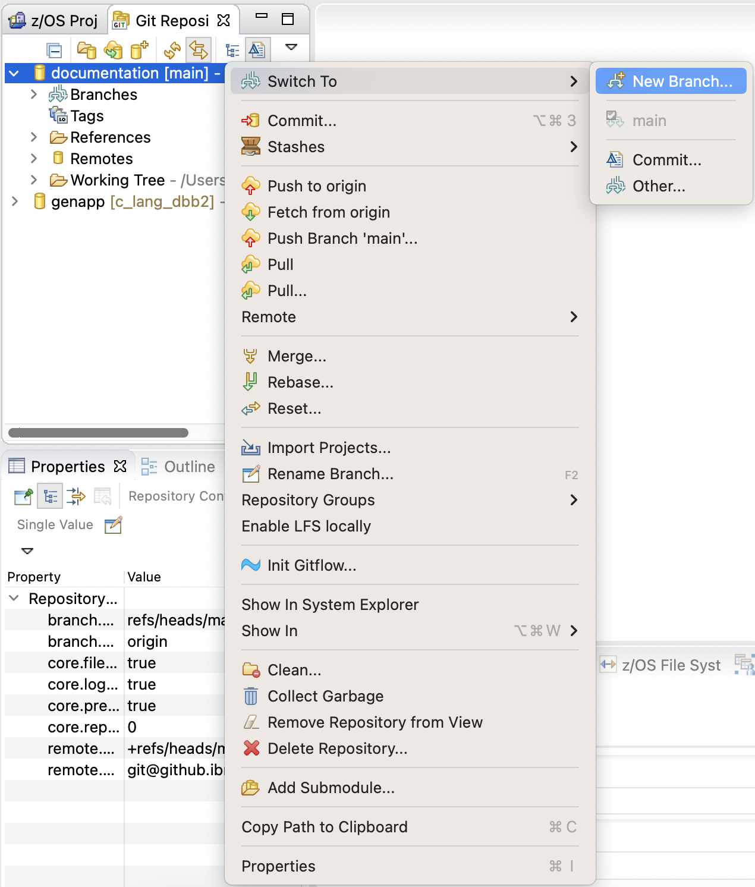
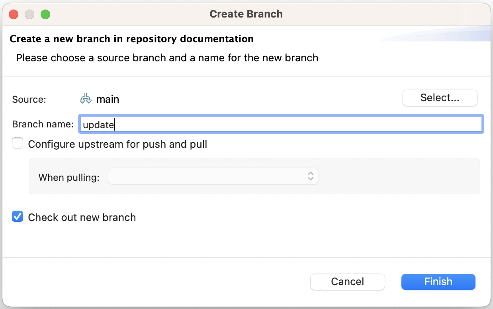
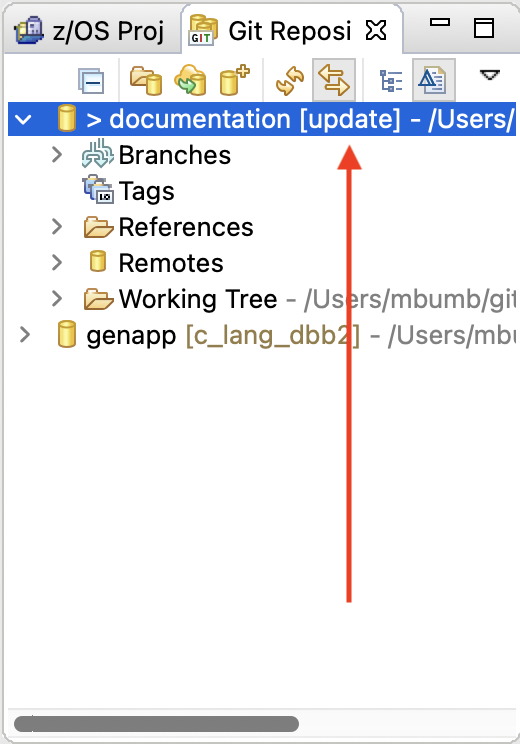

# Day In The Life of a z/SO Developer - Create a Feature Branch

When working with a git repository, the first steps are to clone that repo locally on your machine, and then create a feature branch to make changes in.

## Prerequisites

Before cloning a git repository, you will need to generate an SSH key pair on your local machine, and add the public key to your github account.  Please see step 5.2.2 [here](https://www.ibm.com/support/pages/system/files/inline-files/Building%20a%20Modern%20Pipeline%20on%20Mainframe%20-%20Main%20Proof-Of-Concept%20Cookbook%20%20V3.1.pdf).

## Clone repository

To clone a git repositoy in IDz, first bring up your repo in an IBM approved web browser (https://github.ibm.com/cio-ci-cd/documentation, for example), and click on the green Code button - a Clone menu should open.  In this menu, click on SSH, then copy the address by clicking the copy icon to the right of the address.

Over in IDz, on the top-left side of the window, you'll see 2 tabs - z/OS Projects, and Git Repositories.  Click on the Git Repositories tab and then click on the clone button:

In the window that opens, paste the copied address in the URI field, then press Next.

On the next screen, select any branches you want to clone (at minimum, you will need to clone main), and press Next.

On the next screen, tell IDz where you want the repository stored locally, then press Finish to clone the repo.

After IDz is finished cloning the repo, you should see it in Git Repositories tab in the upper left of IDz.

Select your git repository, right click on it, and select Create a z/OS Project.

## Create feature branch

To create a feature branch to work on, select your git repository, right click on it, and select Switch To->New Branch.

In the window that opens, type the name of the new branch you wish to create, then click Finish.

This will create a new local branch for you to work on, and switch you to it - you can see the name of the branch you're currently working on next to the repository name.

