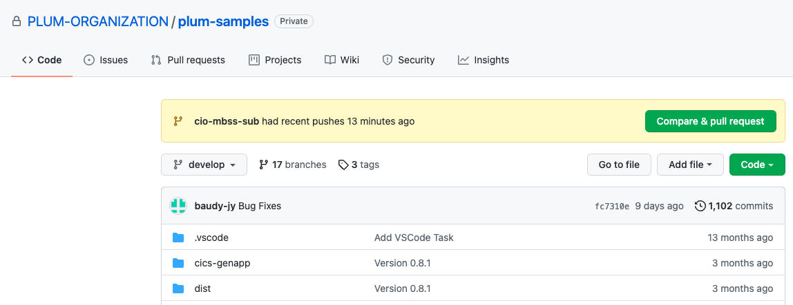
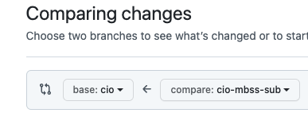
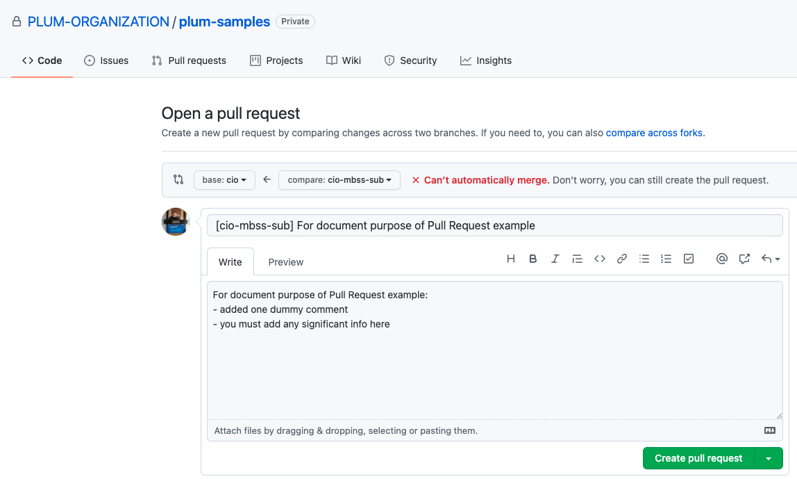
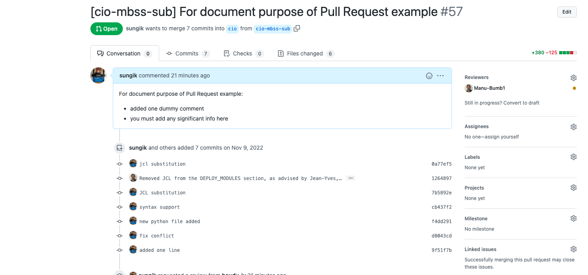

# DayInTheLife - Create Pull Request for Deployment

Pull Request is a proposal of potential changes.

After you pushed your new or modified code to the remote feature branch, you must "pull request", which is a feature of the git hosting service GitHub.
Usually different feature branches are created and updated by different developers, and while different developers are working on different branches on different features, it is important to communicate between different developers or collaborators. Master branch is main branch of the project, and all feature branches are merged into master branch. The entire communication between different developers may easily happen using pull requests.  In our example, we will use "cio" branch as the master branch and f"cio-mbss-sub" as the feature branch.

When you make a pull request with a specific feature branch, you are asking "Please checkout this new branch, pull updates from the remote server, and checkout new feature, and give me your feedback. The approver will pull and check it.

## Step 1: Launch the target GitHub Repository

Launch the target GitHub Repository and verify that your feature branch has pushed with "Compare & pull request" button.
Click "Compare & pull request" button.

## Step 2: Change the base branch 

Make sure you change the base branch to "cio" by selection while compare branch is your feature branch.

## Step 3: Fill in with appropriate description

Fill the subject and write the meaningful description and press "Create pull request" button.

## Step 4: Assign Reviewer(s)

When pull request is opened, you add some description to this pull request in order to describe changes that you have made in this feature branch and after pull request is created, you can request review by other developers, and for example, you know Manu as a developer, and you decides to ask Manu to review this newly opened pull request, and you can notify Manu about it, for example, using either or email or any communication tool, for example, slack or something else, and when Manu receives this notification from you, he starts review process of the pull request. 

When the review process was completed and reviewer has reviewed changes made by you and the reviewer is happy with those changes, the reviewer approves those changes, and now, it becomes possible to merge the feature branch into master branch and apply new changes. 
