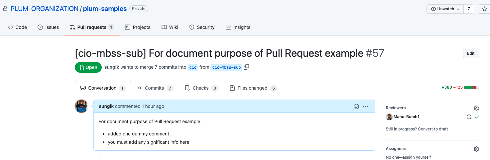
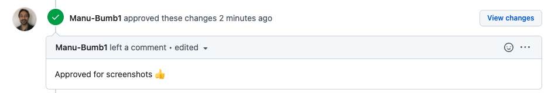
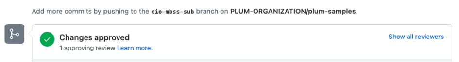
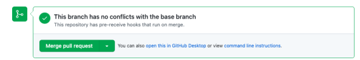
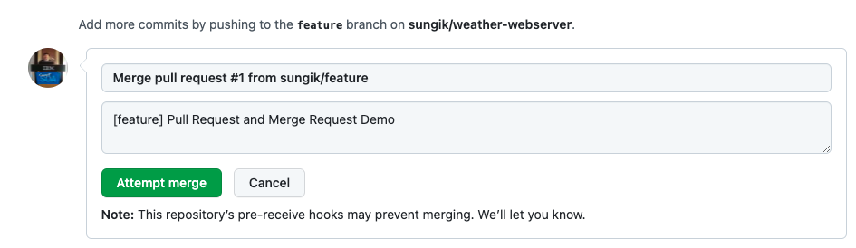
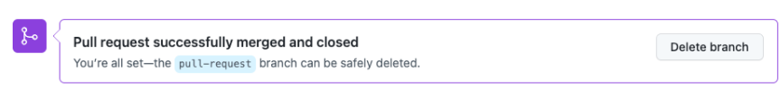

# DayInTheLife - Merge Pull Request

When the review process was completed and reviewer has reviewed changes made by you and the reviewer is happy with those changes, the reviewer approves those changes, and now, it becomes possible to merge the feature branch into master branch and apply new changes. 

When you have permission to perform merging after the approver(s) approve(s) pull request, you can merge your feature branch to the main branch.  After merging, you may simply close pull request and delete corresponding remote feature branch. Local feature branch may be also deleted as well, and when this entire process was finished, new feature was actually implemented and can be used on production or on staging. 

## Step 1: Open the pull request to verify the PR is approved

Open the pull request and verify that your reviewer has approved by checking check mark next to your reviewer icon.
Click "Compare & pull request" button.

You will see approver's comment when you page further down.

## Step 2: Merge pull request

You will see "Change approved" status.

Make sure that the feature branch has no conflicts with the base branch.

Click "Merge pull request" button.

You will be prompted to the following. Clik on "Attempt Merge" button.

## Step 3: Merge Completed

You will see the following message.

