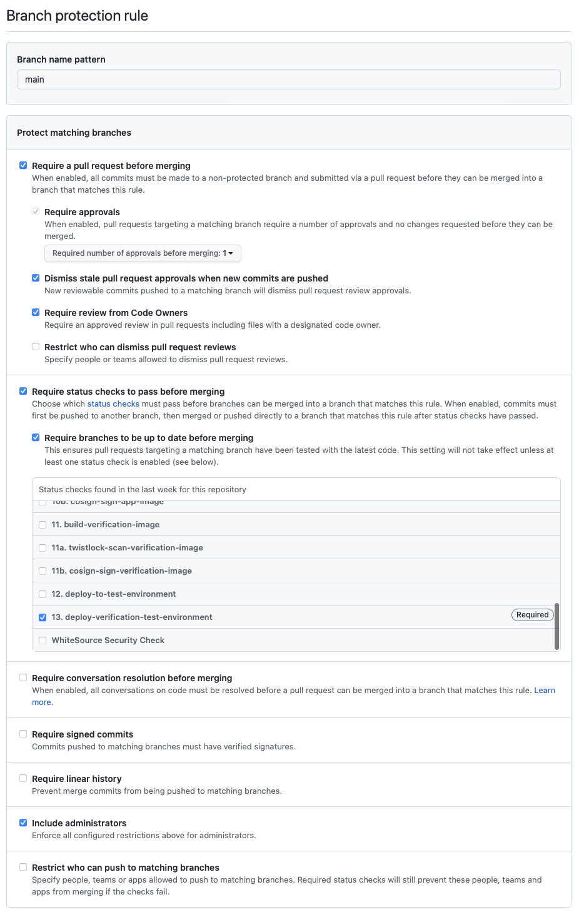

# Branch Protection Rules

Branch protection rules are a best practice for GitHub repositories to ensure code changes are reviewed before they are merged into the default/production code branch. This document describes what we view as an appropriate setup for repositories.

GitHub also has great documentation on branch protection rules [here](https://docs.github.com/en/enterprise-server@3.3/repositories/configuring-branches-and-merges-in-your-repository/defining-the-mergeability-of-pull-requests).

## Protect the Default Branch

It is the expectation of the CIO CI/CD team that the source code in your default branch is a representation of what is currently running in production. You may change which branch is the default branch in GitHub, but our team uses the default `main`. Whatever branch you choose to be the default, remember that this branch represents the production environment, so we need to protect any changes against it.

In GitHub, any branch can have a rule protecting it. However, at a minimum, the default branch should be protected. Rules are matched to branches using `fnmatch` syntax, but the simplest way to create a rule is to match the name of your default branch, for example `main`.

Learn more about branch rule name patterns [here](https://docs.github.com/en/enterprise-server@3.3/repositories/configuring-branches-and-merges-in-your-repository/defining-the-mergeability-of-pull-requests/managing-a-branch-protection-rule#about-branch-protection-rules).

## Require a Pull Request Before Merging

By enabling this rule, GitHub will make sure that changes to a repository's default branch can only be made via the GitHub Pull Request workflow. This gives an opportunity for the reviewers on your team to check the code change before it goes to production. In addition, because the CI/CD pipeline runs on these branches, it is also an opportunity to review vulnerability scan results, code quality, etc. before release.

### Require Approvals

With this rule enabled, you can set the amount of reviewers required for a Pull Request. You should set this to at least one, which will ensure at least two people are involved before a code change is added to the default branch. Requiring another human to review each change before it is merged distributes responsibility across the team. In larger teams, or on projects which accept external contributions (i.e. Inner Source), the list of pull request approvers can be limited using a GitHub CODEOWNERS file.

### Dismiss Stale Pull Request Approvals When New Commits Are Pushed

When changes are pushed to a branch with an approved Pull Request, the Pull Request approval is dismissed, thus requiring another review and approval cycle. This feature prevents additional changes from being made after a review has been completed.

### Require Review from Code Owners

This rule should be set if you're using Code Owners in your repository. In those cases, this rule requires Pull Request reviews from Code Owners when the files changed have a designated Code Owner.

## Require Status Checks to Pass Before Merging

This rule requires any automation you're using to pass before a change can be merged to the protected branch. This is especially useful if you want to make sure your application successfully completed the CI/CD process on a feature branch before merging into your default branch

### Require Branches to be Up to Date Before Merging

By checking this rule, GitHub will ensure the feature branch has the latest code before status checks pass. This is especially useful for cases when multiple developers are working on the repository at the same time. With this rule set, you can have confidence that the full set of changes are being tested by the CI/CD process.

## Include Administrators

Everyone on the team should be included in these rules, including the administrators on your team.

## Example

Here's an example of the rule we've created for one of our repositories. We've selected the options outlined above.

