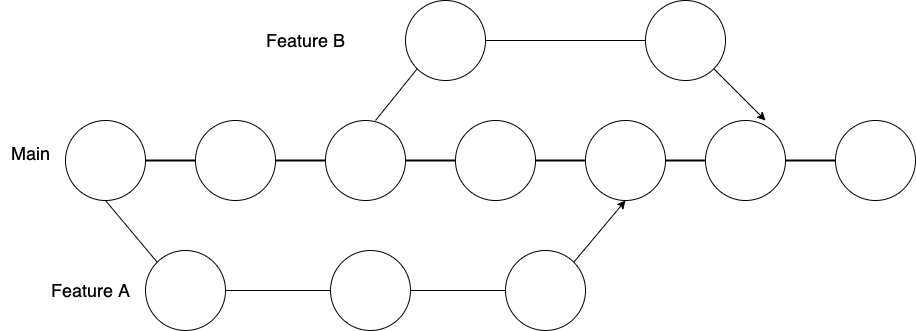
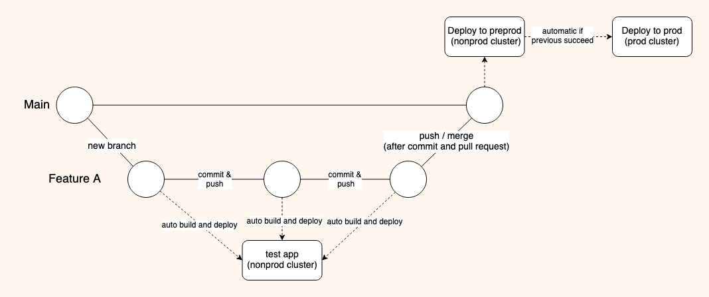
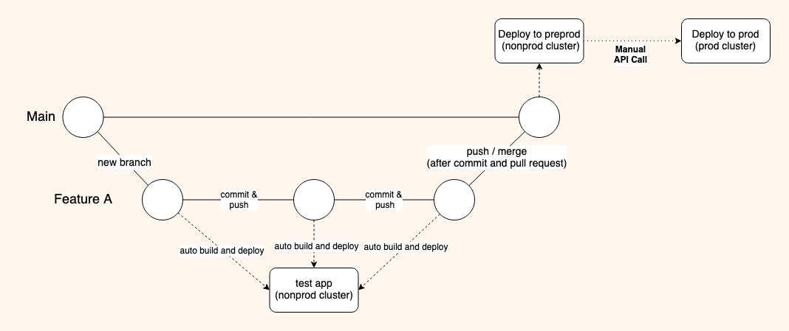
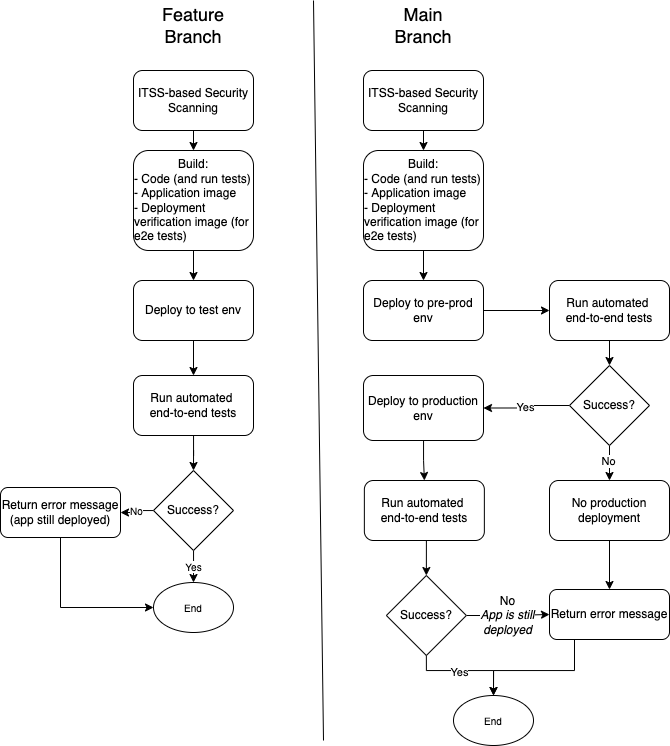

# Overview

This page describes the Github development flow for CIO CI/CD. It is focused on container pipelines that deploy to Cirrus, covers the difference between builds and deploys on feature vs default branches, and how to best take advantage of the product.

## Strategy and Design

[Trunk-based](https://cloud.google.com/architecture/devops/devops-tech-trunk-based-development) development is core to the design of CIO CI/CD.

Changes are made on short-lived branches dedicated to discrete features (feature branches). They are small and isolated to facilitate rapid deployment.

Comprehensive and meaningful unit and end-to-end tests enable teams to fully leverage the benefits of Trunk-based development.

## Deployment Flow

A GitHub repository configured for CIO CI/CD has:

- **One** *pipeline*
- **Three** general *environments*: test, pre-production, and production (+ additional environments when using container release strategy)
- On **two** *clusters*: nonprod and prod

We recommend requiring Pull Requests reviewed by at least one member of the team. CIO CI/CD will trigger automated checks to analyze vulnerabilities, run unit tests, and run other CI/CD tasks in preparation for the Pull Request review.

### Standard Release Flow
Focusing on Feature A from the above diagram, the deployments work as outlined here:

### Container Release Flow
The deployments work as outlined here:

## Steps

The CI/CD pipeline is triggered by pushing your changes to GitHub. The pipeline will run through the following steps:

For the most part, the pipeline execution on the default branch is very similar to the execution on the feature branch. The primary difference is this pipeline will deploy the image to two environments: first it will deploy to pre-prod, and if everything was successful with that deployment it will deploy to production next.

## Key Benefits

- CIO CI/CD creates a new, dedicated application for each feature.
- The Pull Requests review process allows for stakeholder input and approval on each feature.
- Team members can work in parallel unlocking more frequent releases.
- It is easier to write comprehensive tests for small features.
- Trunk-based development reduces risk.

## Frequently Asked Questions

??? question "'Why does the test image not get deployed directly to production?'"

    <a id='notdeployed' href='#notdeployed'>Link to this section</a>

    In this example, a repository has two open feature branches and my-new-feature2 is merged first:

        `my-new-feature1`
        `my-new-feature2`

    If` my-new-feature1` was merged next, it would not contain and will overwrite the changes from `my-new-feature2`.

??? question "'What is CIO CI/CD’s build versioning strategy?'"

    <a id='versionstrategy' href='#versionstrategy'>Link to this section</a>

    Please see https://pages.github.ibm.com/cio-ci-cd/documentation/versioning/

??? question "'How are the environments kept clean?'"

    <a id='clean' href='#clean'>Link to this section</a>

    - Production: CIO CI/CD does not delete any production images with automation.  Users can manually delete applications from the Cirrus portal.
    - Non-production: When a feature branch is deleted, CIO CI/CD automatically deletes corresponding application.

??? question "'Why is the Cirrus application still not deleted after merge?'"

    <a id='delete' href='#delete'>Link to this section</a>

    Either manually delete in Github or GitHub can be configured to automatically delete branches on merge.
