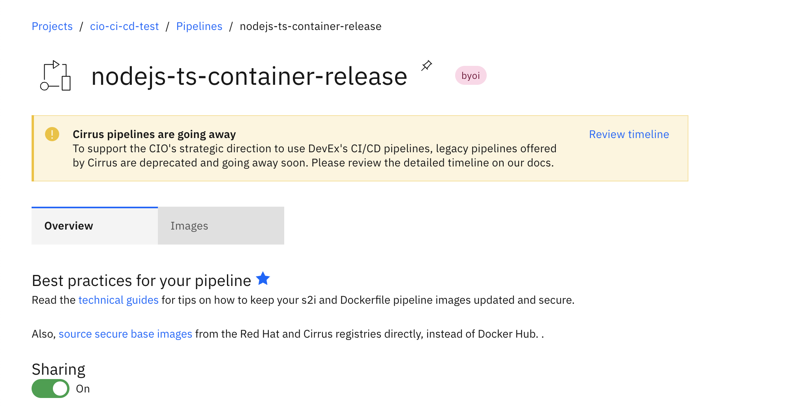

!!! warning "Not available on every community-supported pipeline"
    See [which community pipelines](../decision/#community-supported-pipelines) are supported by container-release on our pipeline decision page.

# Overview
By following this guide, you'll learn about deploying to multi-environment and/or multi-project when using the `container-release` strategy. Multi-project and multi-environment can be used together to achieve flexible deployment strategies.

## Multi Project
Users have the option to add a unique `cirrus-project-name` across different environments such as `test`, `pre-production`, and `production`. Each cirrus project needs to have a pipeline name that matches the corresponding `cirrus-pipeline-name` config param on your `build.yml`.

## Multi Environment
You can have more environments than the default three: `test`, `pre-production`, and `production`. These additional multiple environments can be target deployed using the [release API](./container-release.md/#release-api) from the `default` branch. This allows you to deploy the same image to multiple Cirrus `Applications` in different `Projects`.

## Shared Configuration
When a config value is not defined under `release.environments`, its value is retrieved from the `build.config` section.
In the example below, all three environments will share the value for `cirrus-pipeline-name`, while under `production`, the `cirrus-project-name` is overridden with `<PROD-PROJECT-NAME>`

```yaml
apiVersion: automation.cio/v1alpha1
kind: RepositoryConfig
ealImapNumber: xxxxxx
build:
  config:
    cirrus-project-name: <DEV-PROJECT-NAME>
    cirrus-pipeline-name: <DEV-PROJECT-PIPELINE-NAME>
release:
  environments:
    - name: test
    - name: pre-production
    - name: production
      cirrus-project-name: <PROD-PROJECT-NAME>
```

## Feature Branches (Non-Default Branch)
Pipelines only deploy to the `test` environment on feature branch deployments. The `cirrus-project-name` param specified for the `test` environment will be used when deploying feature branches.

Each feature branch gets deployed to a unique Cirrus Application (according to the test environment configuration) on the non-prod Cirrus cluster. When a feature branch is deleted, the corresponding `test` Cirrus Application is deleted with automation.

## Main / Master (Default Branch)
Upon a merge to the default branch, a build that deploys to a `pre-production` environment is triggered. It does not proceed to deploy to `production` automatically.

Following a successful deployment to `pre-production`, a release event can be triggered to deploy to the Cirrus Project configured for any number of custom environments. The image is pulled from the Cirrus Project and Pipeline that was defined for `pre-production`.

!!! Warning
    Cirrus Pipeline sharing option is required to be enabled only when the `pre-production` and targeted environment projects are different. This is so that the Cirrus Project where the image is stored can be pulled by the Cirrus Project where it is to be deployed. When a pipeline is shared, the images produced by the pipeline can be pulled by any user with Cirrus Image Credentials. If this does not meet your application's requirements, please contact our support channel [#dx-platform-support](https://ibm-cio.slack.com/archives/C02AM16DR19)



## Repository Config Examples

### Multi Project

To configure the repository for multi-project deployment, update any of the release environments named `test`, `pre-production`, and/or `production` in the `build.yml` with each desired project and pipeline name.

In the following example of a build.yml, push events on both feature branches (test environment) and the default branch (pre-production environment) are built and deployed to a "dev" project. Release events to the production environment are deployed to a "prod" project. In this example, sharing must be enabled in the "dev" project's Cirrus Pipeline.

```yaml
apiVersion: automation.cio/v1alpha1
kind: RepositoryConfig
ealImapNumber: xxxxxx
build:
  config:
    cirrus-project-name: <DEV-PROJECT-NAME>
    cirrus-pipeline-name: <DEV-PROJECT-PIPELINE-NAME>
    ...
    ...
release:
  environments:
    - name: production
      cirrus-project-name: <PROD-PROJECT-NAME>
```

In the next example of a build.yml, push events on feature branches (test environment) are built and deployed to a "dev" project. Push events on the default branch (pre-production environment) are built and deployed to a "prod" project.  Release events to the production environment are also deployed to the "prod" project. In this example, sharing does not need to be enabled in the "prod" project's Cirrus Pipeline.

```yaml
apiVersion: automation.cio/v1alpha1
kind: RepositoryConfig
ealImapNumber: xxxxxx
build:
  config:
    ...
    ...
    ...
release:
  environments:
    - name: test
      cirrus-project-name: <DEV-PROJECT-NAME>
      cirrus-pipeline-name: <DEV-PROJECT-PIPELINE-NAME>
    - name: pre-production
      cirrus-project-name: <PROD-PROJECT-NAME>
      cirrus-pipeline-name: <PROD-PROJECT-PIPELINE-NAME>
    - name: production
      cirrus-project-name: <PROD-PROJECT-NAME>
      cirrus-pipeline-name: <PROD-PROJECT-PIPELINE-NAME>
```

In the next example of a build.yml, push events on feature branches (test environment) are built and deployed to a "dev" project. Push events on the default branch (pre-production environment) are built and deployed to a "uat" project.  Release events to the production environment are deployed to the "prod" project where the image is pulled from the "uat" Cirrus Pipeline. In this example, sharing needs to be enabled in the "uat" project's Cirrus Pipeline.

```yaml
apiVersion: automation.cio/v1alpha1
kind: RepositoryConfig
ealImapNumber: xxxxxx
build:
  config:
    ...
    ...
    ...
release:
  environments:
    - name: test
      cirrus-project-name: <DEV-PROJECT-NAME>
      cirrus-pipeline-name: <DEV-PROJECT-PIPELINE-NAME>
    - name: pre-production
      cirrus-project-name: <UAT-PROJECT-NAME>
      cirrus-pipeline-name: <UAT-PROJECT-PIPELINE-NAME>
    - name: production
      cirrus-project-name: <PROD-PROJECT-NAME>
      cirrus-pipeline-name: <UAT-PROJECT-PIPELINE-NAME>
```

### Releasing to Custom Environments
The build.yml example below shows us adding a new environment called `uat-east` that can be used in release requests. This configuration uses a single Cirrus project for all environments. Any additional environments are automatically defaulted to be `non-production`, deploying to a non-prod cluster. To mark a custom environment to deploy to a production cluster, you must mark it with the `is-production` key with `"true"` (the **double quotes are necessary**). See example.

```yaml
apiVersion: automation.cio/v1alpha1
kind: RepositoryConfig
ealImapNumber: xxxxxx
build:
  config:
    cirrus-region: us-south2 # single region, can be multi region as well
    cirrus-project-name: <PROJECT-NAME>
    cirrus-pipeline-name: <PROJECT-PIPELINE-NAME>
    ...
release:
  environments:
    - name: test
      deploy-verification-secret-test: name1
    - name: pre-production
      deploy-verification-secret-preprod: name2
    - name: production
      deploy-verification-secret-prod: name3
    - name: uat-east # this is the custom environment for release requests
      cirrus-region: us-east1 # overrides the value under build.config, can be multi-region as well
      is-production: "true" # if "true", goes to us-east1-prod cluster, if "false", nonprod cluster
```

!!! note

    When deploying to custom environments, please make sure to provide [customized resources](./cirrus-deployment-customization.md) in the `deploy` folder, respecting your desired custom environment name provided in the release section.
    Below, you can find an example when declaring two custom environments (`custom-env-nonprod` and `custom-env-prod`) in the build.yml

    ```
    .
    ├── README.md
    ├── build.yml
    ├── deploy
    │   ├── pre-production
    │   ├── production
    │   ├── test
    │   └── custom-env-nonprod
    │       └── application.yaml
    │       └── route.yaml
    │   └── custom-env-prod
    │       └── application.yaml
    │       └── route.yaml
    ├── package-lock.json
    └── package.json
    ```

    In addition, make sure your custom resources, provided in the custom environment deploy folders, declare unique names.

    Example:
    ```
    # ./deploy/custom-env-nonprod/application.yaml

    apiVersion: cirrus.ibm.com/v1alpha1
    kind: Application
    metadata:
      name: orgname-reponame-custom-env-nonprod
    # ...
    # rest of application.yaml
    ```

### Multi-Project and Multi-Environment
For users who need to deploy to multiple Cirrus Projects, we will demonstrate adding an environment below. Here an environment called `uat-east` deploys to a different project. Sharing must be enabled in the `dev` Project's Cirrus Pipeline.

```yaml
apiVersion: automation.cio/v1alpha1
kind: RepositoryConfig
ealImapNumber: xxxxxx
build:
  config:
    cirrus-region: us-south2 # single region, can be multi region as well
    cirrus-project-name: <DEV-PROJECT-NAME>
    cirrus-pipeline-name: <DEV-PROJECT-PIPELINE-NAME>
    ...
release:
  environments:
    - name: test
      deploy-verification-secret-test: name1
    - name: pre-production
      deploy-verification-secret-preprod: name2
    - name: production
      cirrus-project-name: <PROD-PROJECT-NAME> # Note different project name
      cirrus-pipeline-name: <UAT-PROJECT-PIPELINE-NAME> # But it refers to the Pipeline of the UAT environment
      deploy-verification-secret-prod: name3
    - name: uat-east
      cirrus-region: us-east1
      is-production: "true"
      cirrus-project-name: <UAT-PROJECT-NAME> # Note different project name from production
      cirrus-pipeline-name: <UAT-PROJECT-PIPELINE-NAME> # But it uses a single Pipeline Name
```
