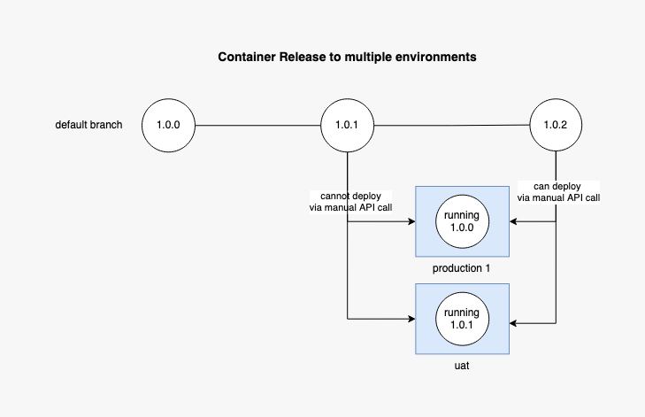
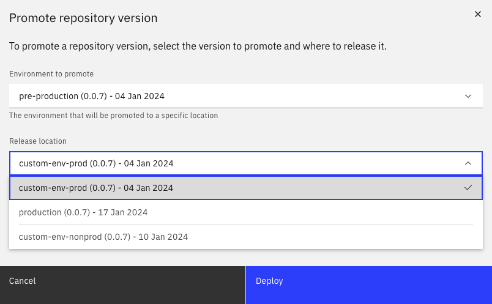
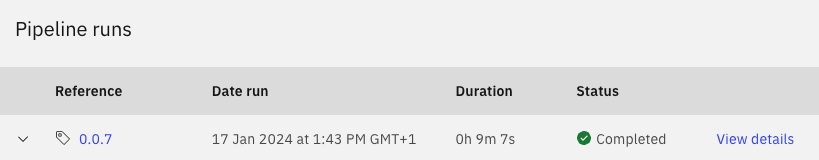
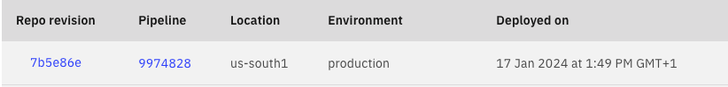
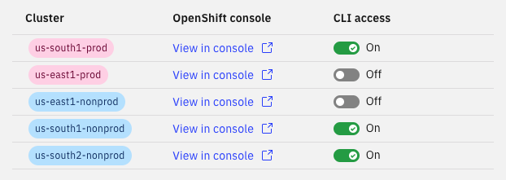

!!! warning "Not available on every community-supported pipeline"
    See [which community pipelines](../decision/#community-supported-pipelines) are supported by container-release on our pipeline decision page.

# Overview
In our [standard deployment strategy](../cirrus-branch-strategy/#standard-release-flow), the expectation is that the source code in your default branch (usually `main`) is a representation of what is currently running in production.

The [container-release strategy](../cirrus-branch-strategy/#container-release-flow) enables teams to deploy and validate applications in `pre-production` before manually releasing them to any number of environments on Cirrus.

## Strategy and Design
The latest `production` git tag is the only version to which manual container releases can be triggered.

This is to align teams with [trunk-based](https://cloud.google.com/architecture/devops/devops-tech-trunk-based-development) development which is core to our design, as well as being flexible to users who require additional checks by another party outside of the development team. This is why we do not support the usage of long-lived feature branches: we encourage patching forward and the default branch serving as the main source of truth.

Teams who are not confident with their e2e test coverage can use the container-release strategy in the meantime.

See [cirrus-multi-project-and-environment](./cirrus-multi-project-and-environment.md) for more implementation details.

## Release via My Developer Portal
The Container release feature is now available in [My Developer Portal](https://cirrus.ibm.com/developer).

### How to perform a release with My Developer Portal
Once you open the [My Developer Portal](https://cirrus.ibm.com/developer), follow the next steps:

- Navigate to the specific repository page
- Expand the `Actions` dropdown on the top right
- Click the `Release code` item
- Select the `Environment to promote` and the `Release location`
- Click the Deploy button to start a new release pipeline

### Validation checks
There are multiple validation checks for the container release.

- The `test environments` are not available in the dropdowns;
- The `pre-production` environment is not available as `Release location`;
- The version selected for `Environment to promote` needs to be newer than the version in `Release location`;
- In the case of `multi-region`, the deployment is successful only when the new version is correctly promoted in all regions;

### Monitor the release

Once you click the `Deploy` button, a new pipeline will start, you can verify the results of that pipeline in the `Pipeline metrics` tab.

A successful pipeline will result in a new record in the `Deployments` tab, this confirms that your release has been successful.

For multi-region release, in case of failure to promote to a specific region, ensure that the cluster is enabled in Cirrus.

## Release API


