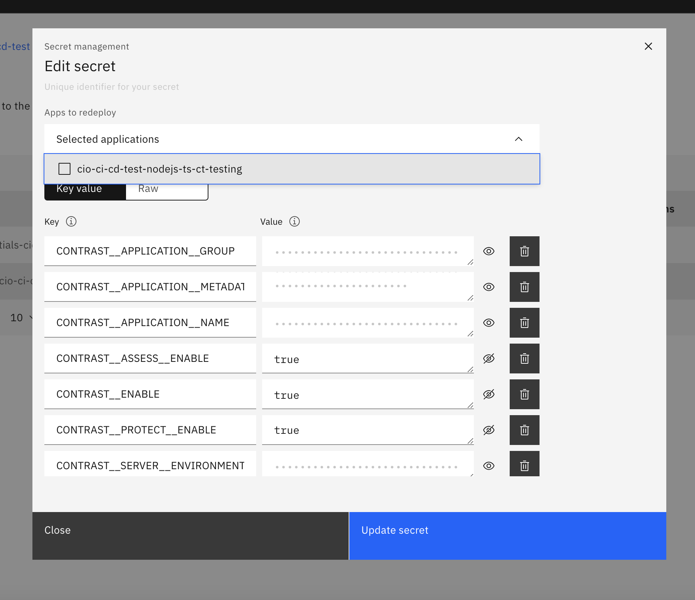

## Contrast Overview

By the end of this guide, you should be able to run contrast for your application for test environment. Your repository should be set up such that every commit may trigger a build and deploy. 

## Language Support

- Node.js
- Python
- Java

## ServiceNow Request

1. Request access to Contrast via ServiceNow on the [Contrast dashboard](https://ibm.service-now.com/ciso_contrast). Click **Create Request** on the ServiceNow page to get started and fill out the fields on the CISO Contrast Service Request form with your business justification. 
See the [CISO documentation about Contrast](https://w3.ibm.com/w3publisher/ciso-appsec/services/contrast-security) for more information. 
1. Upon succesful approval of your Contrast request, you will have a `Application Name` which you can see in ServiceNow.  This will be the value you set as `contrast-application-group` in CIO CI/CD. **Be sure you write the Application Name exactly as it is written in order to properly link CIO CI/CD to Contrast**.
1. Update your `build.yml` with the application group name as follows:
    ```
    ...
    build:
      config:
        contrast-application-group : XXXXXX
    ```

## Code Changes
   
### **Node**

Update the start script of your `package.json` to utilize @contrast/agent as follows:

```
    "scripts": {
        "start": "node -r @contrast/agent build/server.js",
    }
```

### **Python**

Wrap wsgi call per Contrast doc: [https://docs.contrastsecurity.com/en/python-middleware.html](https://docs.contrastsecurity.com/en/python-middleware.html)

1. Push the code and wait for the pipeline to complete.

### **Java**

No code changes are necessary for Java.  Enable Contrast per the instructions below.

## Enable Contrast

1. Go to the Cirrus portal and click through to the deployed application's overview page. Under the `Environment from Secrets` section of the application, you should see a secret that begins with the name `contrast-config`. Enable contrast by updating the environment variables as shown in the table below.

    | Variable | Default |
    | - | - |
    | CONTRAST__ENABLE | true |
    | CONTRAST__ASSESS__ENABLE | true |

1.  Select the application from the `Apps to redeploy` drop down menu.

    - 

1.  Click **Update Secret** to save and restart the application with Contrast enabled.

## Configure Contrast Credentials

!!! note
    Contrast Credentials can be used globally across multiple branches per repository. If Contrast has been enabled and you have configured your Contrast credentials (once per repository), all associated branches will use the same secret.


1. Log into [https://app.contrastsecurity.com/](https://app.contrastsecurity.com/)

1. Under your profile, go to `User Settings`

1. Copy the `YOUR-API-KEY` and `SERVICE-KEY`

1. Go to the [Cirrus portal](https://cirrus.ibm.com/) and click through to the `Secrets` Overview page. You should see a secret that begins with the name `contrast-credentials`. Configure the secret by updating Keys that don't have a corresponding Value (see table below).

    | Key | Value |
    | - | - |
    | CONTRAST__API__API_KEY | `YOUR-API-KEY` |
    | CONTRAST__API__SERVICE_KEY | `SERVICE-KEY` |
    | CONTRAST__API__USER_NAME | `YOUR-EMAIL` |

1.  Select the application from the `Apps to redeploy` drop down menu.

    - 

1.  Click **Update secret** to save and restart the application with your Contrast Credentials configured.

!!! note

    Please make sure you increase the Memory Tier in your Cirrus Application when you enable contrast.
## Failure Scenarios / Troubleshooting

1. In case of an app failure, disable Contrast to see if it's an app related failure or an issue with Contrast.  Note: Contrast can fail without indication.
1. Check the start up logs for the webserver.


## Contact

If you have questions about setup, reach out to the [#dx-platform-support](https://my.slack.com/archives/C02AM16DR19) channel.

For issues with the Contrast application or results, reach out to [#sos-contrastsecurity](https://my.slack.com/archives/C5SEMQERZ).