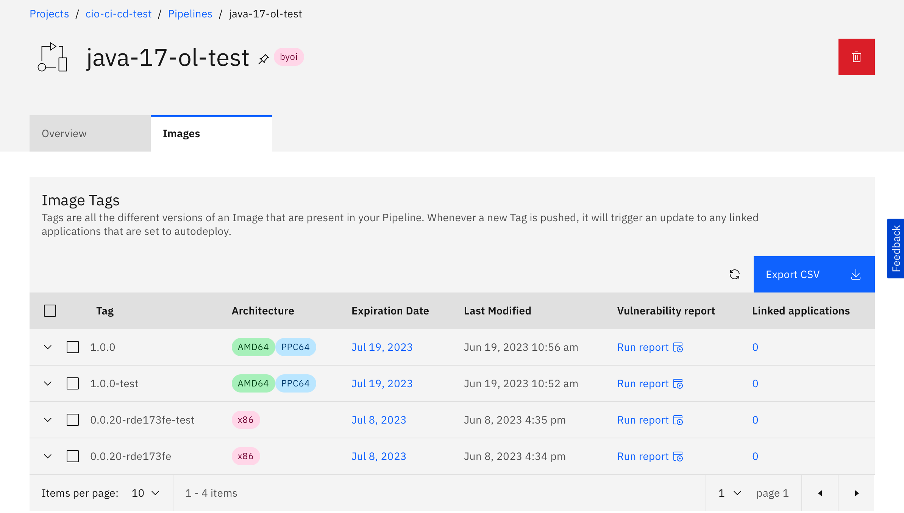

This page contains common questions and issues reported using CIO CI/CD.

## Frequently Asked Questions

??? question "'Is is possible to not trigger a deployment when a PR is merged?'"

    <a id='notrigger' href='#notrigger'>Link to this section</a>

    For any pipeline, if you put [CI_SKIP] in your commit message, the pipeline will not execute.

??? question "'Is there a way to simply trigger my pipeline again other than pushing a new change to my GHE repo?'"

    <a id='retrigger' href='#retrigger'>Link to this section</a>

    Builds are currently only triggered by new commits. Please push a new commit.

    If there's no code changes, you can always just go to the Cirrus dashboard to redeploy your Application. [https://cirrus.ibm.com/](https://cirrus.ibm.com/).

??? question "'What tools/scans run as a part of CIO CI/CD?'"

    <a id='what-tools-scans' href='#what-tools-scans'>Link to this section</a>

    Please see our Features and Roadmap page: [https://pages.github.ibm.com/cio-ci-cd/documentation/features-roadmap/](https://pages.github.ibm.com/cio-ci-cd/documentation/features-roadmap/)

??? question "'Can I use my own dockerfile?'"

    <a id='own-dockerfile' href='#own-dockerfile'>Link to this section</a>

    The short answer is no, read more to learn why: [https://pages.github.ibm.com/cio-ci-cd/documentation/dockerfile-support/](https://pages.github.ibm.com/cio-ci-cd/documentation/dockerfile-support/)

??? question "'Does the WhiteSource / Mend scan task fail if vulnerabiities are detected?'"

    <a id='does-mend-fail' href='#does-mend-fail'>Link to this section</a>

    The WhiteSource / Mend task does not fail if vulnerabilities are detected at this time, but doing so is on our plan.

??? question "'How can I deploy to multiple regions?'"

    <a id='multiple-region-support' href='#multiple-region-support'>Link to this section</a>

    We do not support deployment to multiple regions at this time, but will be evaluating this feature in early 2023.

??? question "'How can I add env var secrets to my build?'"

    <a id='add-env-secrets' href='#add-env-secrets'>Link to this section</a>

    Application runtime and verification tests support env var secrets.

    For app runtime, see [https://pages.github.ibm.com/cio-ci-cd/documentation/cirrus-deployment-customization/#environment-variables](https://pages.github.ibm.com/cio-ci-cd/documentation/cirrus-deployment-customization/#environment-variables). For verification tests, see [https://pages.github.ibm.com/cio-ci-cd/documentation/cirrus-deployment-testing/#secrets](https://pages.github.ibm.com/cio-ci-cd/documentation/cirrus-deployment-testing/#secrets)

??? question "'How can I decrypt environment variables?'"

    <a id='decrypt-env-vars' href='#decrypt-env-vars'>Link to this section</a>

    Currently, we do not support decryption as a security feature. If you're unsure about an encrypted value, our recommendation is to re-encrypt the value. [https://pages.github.ibm.com/cio-ci-cd/documentation/nodejs-and-cirrus/#step-5-make-code-changes](https://pages.github.ibm.com/cio-ci-cd/documentation/nodejs-and-cirrus/#step-5-make-code-changes)

??? question "'Where can I find my EAL number?'"

    <a id='where-eal' href='#where-eal'>Link to this section</a>

    A valid ealImapNumber must be in your build.yml.
    Find or Create your EAL here: [https://ibm.decisionfocus.com/administrate/workspacesDocs](https://ibm.decisionfocus.com/administrate/workspacesDocs)

??? question "'Will Github Actions be available?'"

    <a id='ghe-actions-support' href='#ghe-actions-support'>Link to this section</a>

    This team does not manage the GitHub deployment. Inquire in [#whitewater-github](https://my.slack.com/archives/C3SSJ6CSE)

??? question "'We have passed all the checks successfully but when we review the details of 10a. twistlock-scan-app-image step we find some vulnerabilities with severity high & critical. What should we do in this case?'"

    <a id='twistlock-vulnerabilities' href='#twistlock-vulnerabilities'>Link to this section</a>

    Twistlock scans the built docker image which contains your application. If that step fails due to some vulnerabilities discovered, it means that you should have a look at those vulnerabilities and resolve them in order to deploy a secure version for your application.  You can find more information at: [https://w3.ibm.com/w3publisher/cio-cybersecurity-assurance/services/vulnerability-patch-management/twistlock](https://w3.ibm.com/w3publisher/cio-cybersecurity-assurance/services/vulnerability-patch-management/twistlock).

??? question "'Why do Cirrus container images built by CIO CI/CD show multiple architectures like PPC64 and AMD64?'"

    <a id='images-multi-arch' href='#images-multi-arch'>Link to this section</a>

    The CIO CI/CD container image pipelines are now able to build images for multiple CPU architectures and store them in Cirrus. In addition to building applications into an [x86-64/AMD64](https://en.wikipedia.org/wiki/X86-64) image that is deployed to today's Cirrus infrastructure, some pipelines also build [IBM Power](https://www.ibm.com/cloud/architecture/architectures/power/) images that will support future [Red Hat OpenShift for IBM Power](https://www.redhat.com/en/resources/openshift-ibm-power-systems-datasheet) Cirrus infrastructure. This multi-architecture capability of the pipeline is part of a larger, ongoing CIO effort to optimize utilization by placing application workloads on the best infrastructure to run them, regardless of architecture.

    This pipeline enhancement is transparent to developers and no additional configuration is needed. Pipelines will continue to build an AMD64 image and deploy that to Cirrus. Pipelines gracefully handle failures building additional architectures; if the Power image fails to build, this failure will be logged but the pipeline will continue. Presently, only the [Java Maven Open Liberty Pipelines](java-and-cirrus.md) build multiple architecture images. In testing, we found the second architecture adds minimal overhead (2-3 minutes) to the pipeline execution time. By building for this additional architecture now, applications are future-proofed to run on additional Cirrus infrastructure when it comes online.

    In the Cirrus image tag list, these additional architectures are indicated with colored labels. In the example below, the `1.0.0` image tag includes both an **AMD64** (x86-64/AMD64) and a **PPC64** (Power) version. **AMD64**-only images like `0.0.20-rde173fe` may appear as **x86** or **AMD64**.

    

??? question "'Where do the base images used by the CIO CI/CD Pipelines come from?'"

    <a id='base-images-source' href='#base-images-source'>Link to this section</a>

    As a policy, all pipelines that build container images must use a base image that comes from Red Hat or the Cirrus team. Most pipelines use one flavor of Red Hat's Universal Base Image (UBI) as the base image they build on top of. Some pipelines may add additional tools on top of the UBI image and use that new image as the base for future build. Some pipelines pull images from the Cirrus managed registry at registry.cirrus.ibm.com/public. None of our pipelines pull images from external sources such as Docker Hub.

    All pipelines that build container images support the installation of custom software packages through parameters in the build.yml. All of our base images use the DNF package manager to install packages. The resulting image, including any additional packages installed, are scanned by our image scanning tool.

## Troubleshooting

??? question "'Provide this information to facilitate troubleshooting'"

    <a id='facilitation' href='#facilitation'>Link to this section</a>

    If you need help with something that is not working as expected, please include the following information as applicable in your initial message  to [#dx-platform-support](https://my.slack.com/archives/C02AM16DR19):

    1. Org name
    2. Repo name
    3. Branch
    4. Commit ID
    5. Github link if possible.

??? question "'Pipeline does not finish and tasks run indefinitely'"

    <a id='indefinite-pipe' href='#indefinite-pipe'>Link to this section</a>

    In isolated incidences there are connectivity issues and results are not reported back to Github.  If your pipeline is running longer than usual, log into Cirrus and validate pipeline completion there.If it doesn't complete in the expected time, re-run the pipeline.

??? question "'Application and pods starting repeatedly'"

    <a id='repeated-restart' href='#repeated-restart'>Link to this section</a>

    If application pods are restarting repeatedly, that suggests a configuration issue (e.g. a missing environment variable) or missing health-check endpoint. Please review the troubleshooting steps on this page. Make sure your application meets all the requirements for deployment. You can also find more Cirrus logs by launching the "OpenShift console" from Cirrus.

    For support on Cirrus, including runtime issues, please consult the Cirrus documentation at [https://w3.ibm.com/w3publisher/cio-hybrid-cloud-services/support](https://w3.ibm.com/w3publisher/cio-hybrid-cloud-services/support) or reach out to [#cirrus-platform-support](https://my.slack.com/archives/CUACKH2M7).

??? question "'Build is failing when git tag already exists'"

    <a id='failing-when-git-tag-exists' href='#failing-when-git-tag-exists'>Link to this section</a>

    Delete the conflicting tag from GitHub and try your build again.

??? question "'Does not comply with semantic versioning'"

    <a id='semantic-compliance' href='#semantic-compliance'>Link to this section</a>

    CICD only supports semantic versioning [https://pages.github.ibm.com/cio-ci-cd/documentation/versioning/](https://pages.github.ibm.com/cio-ci-cd/documentation/versioning/)
    The version specified for you application seems not compliant with it (1.1 is not a valid semantic versioning). In order to resolve the problem, you need to change your version in your app with the following format MAJOR.MINOR.PATCH e.g. 1.1.0

??? question "'There was an error decrypting parameters'"

    <a id='error-decrypting-parameters' href='#error-decrypting-parameters'>Link to this section</a>

    A cipher text of a secret cannot be shared across multiple repositories. You must re-encrypt new values for new repositories, even if the secret text is exactly the same.

??? question "'The production application is not being created in the production cluster'"

    <a id='app-not-created-in-prod' href='#app-not-created-in-prod'>Link to this section</a>

    First we deploy the application to preprod, which runs in the nonprod cluster. That application must finish deploying successfully before we deploy to the production cluster.

??? question "'image source signatures unauthorized: authentication required'"

    <a id='image-source-signatures-unauthorized' href='#image-source-signatures-unauthorized'>Link to this section</a>

    Cirrus Pipeline credentials are no longer required in the `build.yml` (the `cirrus-pipeline-username` and `cirrus-pipeline-password` params under the build config section). You may remove the credentials but be sure to keep the pipeline name param (`cirrus-pipeline-name`).

    If you have removed the Cirrus Pipeline credentials from the `build.yml` and are still experiencing the error, contact the #dx-platform-support channel.

    As an option, you can also choose to keep the Cirrus Pipeline credentials in the `build.yml`. If so, continue reading:

    This issue could be due to _incorrect permissions_ assigned to the Cirrus Pipeline credentials.

    First, make sure you are able to access the registry locally (it requires enabled VPN):

    ```bash
    docker login -u=REPLACE_WITH_YOUR_CIRRUS_PIPELINE_USERNAME -p=REPLACE_WITH_YOUR_CIRRUS_PIPELINE_PASSWORD registry.cirrus.ibm.com
    ```

    **If you _were able_ to connect to the Cirrus Docker Registry**

    The experienced issue could be related to:

    **Incorrect encryption of Cirrus Pipeline credentials**

    <!-- prettier-ignore -->
    1. Re-encrypt the Cirrus Pipeline credentials (username and password) with the following command:
    
    2. Add the re-encrypted credentials to the `build.yaml` and push new changes to the repository.

    **Incorrect build configuration**

    Make sure you have set the correct `cirrus-project-name` and `cirrus-pipeline-name` values in the `build.yml`.

    **Cirrus Pipeline credentials might not have **write** permissions to the selected pipeline:**

    1. Navigate to the [Cirrus UI Dashboard](https://cirrus.ibm.com/).
    2. Go to `Your Project` -> `Pipelines` -> `Credentials`
    3. Click on the 3 dots for the Pipeline Credentials used and select `Permissions`
    4. Make sure Permission is set to **write** for the expected pipeline (if it does not have any permission, set **write** permissions).
    5. Re-execute the CI/CD steps again.

    **If you are still having issues connecting to the Cirrus Docker Registry**

    

??? question "'Failed to automate the Cirrus Registry Credentials.' in the initialization task logs"

    <a id='failed-automate-registry-creds' href='#failed-automate-registry-creds'>Link to this section</a>

    **When the error sub-text reads:**

    ```
    Failed to verify project access on cluster.

    Could not obtain user token using the provided Cirrus API Credentials.
    ```

    This error occurs when access to the Cirrus Project specified in the `build.yml` under the `cirrus-project-name` parameter could not be verified using the `cirrus-api-username` and `cirrus-api-password` credentials. Review the following steps to troubleshoot and resolve the issue:

    1. Verify that the `cirrus-project-name` parameter in the `build.yml` is a valid Cirrus project name.
    2. Verify that the `cirrus-api-username` and `cirrus-api-password` credentials encrypted in the `build.yml` are valid, not expired, and that the account has permissions to the specified Cirrus project. Cirrus API credentials are created by clicking your user icon on the top-right corner of the Cirrus Portal. These are not to be confused with Cirrus "Pipeline" Credentials that are used to authenticate with the container image registries.
    3. Verify that the `cirrus-region` is set to a valid region. Note: `us-south1` is unavailable due to capacity issues in the `us-south1-nonprod` cluster. Use `us-south2`.
    4. Verify on the Cirrus portal that the account used to create the API Credentials has enabled CLI cluster access on both nonprod and prod for the region specified in the `cirrus-region` param of the `build.yml`.

    **When the error sub-text reads:**

    ```
    13 INTERNAL: Unable to find repository key for owner # / repository # / version #
    ```

    This error occurs when cipher text found in the `build.yml` was encrypted for a different repository. Re-encrypt the values for the correct GitHub organization and repository.

??? question "'Pipeline: <YOUR-PIPELINE-NAME> does not appear to exist in project: <CIRRUS-PROJECT-NAME>. Please, make sure to provide an existing pipeline.' in the initialization task logs"

    <a id='pipeline-not-exist' href='#pipeline-not-exist'>Link to this section</a>

    This error occurs when the `cirrus-pipeline-name` referenced in the build.yml was not first manually created on the Cirrus Portal for the Project.

    We made a recent change that checks that the pipeline was created under your account. Before this change, if you set the `cirrus-pipeline-name` param in your build.yml to a pipeline that didn't first exist in your Cirrus project, that pipeline would be created internally on Cirrus without assigning it to your Cirrus Project making it hidden from you.

    ## In order to fix this, Please do the following:

    1. Create a new Build Pipeline on Cirrus under your desired project with a different name from the one currently in the build.yml
    2. Edit your build.yml to this new Pipeline name

    If you need more guidance, we recommend reviewing our documentation on [Create your Project and Pipeline on Cirrus](./includes/cirrus-project-pipeline.md).

??? question "'exceeded its progress deadline' error during deployment to Cirrus"

    <a id='exceeded-progress-deadline' href='#exceeded-progress-deadline'>Link to this section</a>

    When deploying applications, Cirrus only reports success if the new containers start and respond to health checks. If containers exit early or checks do not succeed, the CD pipeline will fail at this step. In that case, the `deploy-to-test-environment`, `deploy-to-preprod-environment`, or `deploy-to-production-environment` step shows an error in the log similar to the following:

    ```
    Waiting for deployment "your-repo-ab123-branch-name" rollout to finish: 0 of 1 updated replicas are available...
    error: deployment "your-repo-ab123-branch-name" exceeded its progress deadline
    ```

    **Solution:**:

    The deploy step occurs after your code has been successfully unit-tested, built into an image, and pushed to a Cirrus pipeline. Failures at this point usually indicate an issue with resource allocation (quota), health checks, or Cirrus application configuration. Perform the following steps to troubleshoot and resolve deployment issues:

    1. Carefully review your application logs in Cirrus. Look for runtime configuration issues (such as missing secrets) and address those in Cirrus.
    2. Make sure your [Cirrus Project Quota](https://pages.github.ibm.com/CIOCloud/cio-blog/virtualization/get-started/#project-quotas) is appropriately sized. Deployments do not proceed if there is not sufficient quota.
    3. Verify that your app listens and responds to health checks. All Cirrus application deployments require health checks. The default check is an HTTP GET at `/health/ping`.
    4. If you have [customized](cirrus-deployment-customization.md) your `application.yaml` to provide `httpGet` `livenessProbe`s or `readinessProbe`s, verify these include `port` **and** `path`, and that the endpoint returns an HTTP status code of `200` when running.
    5. Carefully inspect application details, conditions, events and pods on the OpenShift Console. To get to the OpenShift Console, first navigate to the [Cirrus Portal](https://cirrus.ibm.com). Select the Cirrus project your application is using, and then click on "Applications" under "Runtime" on the left-panel. Navigate to the application as it is named in the deployment error logs and then click on the "OpenShift console" button on the top-right.
    6. Check with [Cirrus Support - FAQs and #cirrus-platform-support](https://w3.ibm.com/w3publisher/cio-hybrid-cloud-services/support) for assistance with Cirrus issues.

    

??? question "'Internal error occurred: unexpected response: 500' error during deployment to Cirrus"

    <a id='error-500-on-cirrus-deploy' href='#error-500-on-cirrus-deploy'>Link to this section</a>

    Cirrus requires access to cluster be explicitly given, and this is an easily forgotten step. If this is your first time deploying to Cirrus via API, check to make sure your API key has been given cluster access. Please see the [Cirrus documentation](https://pages.github.ibm.com/CIOCloud/cio-blog/cli/#accessing-via-api-key) for guidance.

    An example error message looks like:

    ```
    Attempting to login to Cirrus...
    Login failed due to Error from server (InternalError): Internal error occurred: unexpected response: 500, retrying in 10 seconds, 4 attempts left...
    ```

    **Solution:**

    To fix this problem, visit your Cirrus project overview page to see which clusters you have access to. Use the toggles on the overview page to enable access to the appropriate clusters given your project permission level.

    

??? question "'SIGTERM & npm ERR! Exit status 143' errors when deploying NodeJS applications"

    <a id='exit-status-143-on-nodejs-deploy' href='#exit-status-143-on-nodejs-deploy'>Link to this section</a>

    When deploying NodeJS applications to Cirrus, it might happen to receive these errors when your application is about to start:

    ```
    npm ERR! code ELIFECYCLE
    npm ERR! errno 143
    npm ERR! your-project@x.y.z start: `node dist/server.js`
    npm ERR! Exit status 143
    npm ERR!
    npm ERR! Failed at the your-project@x.y.z start script.
    npm ERR! This is probably not a problem with npm. There is likely additional logging output above.
    ```

    **Solution**:

    Failures at this point usually indicate an issue with resources allocation (quota).

    1. Make sure your [Cirrus Project Quota](https://pages.github.ibm.com/CIOCloud/cio-blog/virtualization/get-started/#project-quotas) is appropriately sized.
    1. Increase your applications' quota through the [customized resources](cirrus-deployment-customization.md) (`application.yaml`).

    ```yaml
    apiVersion: cirrus.ibm.com/v1alpha1
    kind: Application
    metadata:
        name: sample-app
        ...
    spec:
        ...
        # include quota selection. ex: q256mb, q512mb, q1gb (use `oc get quotas` to see the available quotas)
        quota: "q512mb"
    ```

??? question "'no such file or directory' or 'file does not exist' when building the app image or verification image"

    <a id='no-such-file-when-building' href='#no-such-file-when-building'>Link to this section</a>

    Usually, this occurs when a file has not been found or has been filtered out during the app/verification's image creation.

    **Solution**:

    Failures at this point might be resolved by the following steps:

    1. Make sure your file or artifacts exist or get generated before the failing step.
    2. If you have a `.dockerignore` file in your repository's root folder, make sure it's not listing the required file or folder. For example, with Node projects, the `node_modules` directory must not be ignored.

??? question "Errors in Artifactory (during dependency install or publish)"

    <a id='install-publish-artifactory-errors' href='#install-publish-artifactory-errors'>Link to this section</a>

    **Solution**:

    - If Artifactory returns a response code of 401, then the credentials are missing or wrong. To fix, check the private-dependency field of the build.yml. You should re-encrypt this value to fix any errors.
    - If Artifactory returns a response code of 403, this could indicate there is a conflict with the package version. Check if Artifactory already has a package with the same version as the one being published. You could bump the application version (for example in the package.json) in order to avoid the problem.

??? question "The applications '<application_name>' is invalid: metadata.resourceVersion: Invalid value: 0x0: must be specified for an update "

    <a id='invalid-value-0X0-errors' href='#invalid-value-0X0-errors'>Link to this section</a>

    **Solution**:

    - For test environment, simply delete the app from cirrus and redeploy using empty-trigger.
    - For prod environment or applications that can't be deleted:
        - Go to [cirrus](https://cirrus.ibm.com/) -> navigate to the Cirrus project -> and locate your application in the Applications tab
        - Select the Application and click the `Openshift console` button. This will navigate you to the OpenShift web console.
        - Click on your email address on top-right navigation menu and select `Copy login command`.
        - Click on Display Token and use `oc login` on your local terminal/cmd to login into the cluster via CLI.
        - Ensure you are in correct project when successfully logged in via the CLI. Using the `oc` command, find the app in the cluster using `oc get app <application_name>`, with `<application_name>` being the name of your application.
        - Delete `last-applied-configuration:| {"apiVe...}` from metadata with help of `oc edit app <application_name>`and rebuild using empty trigger.
