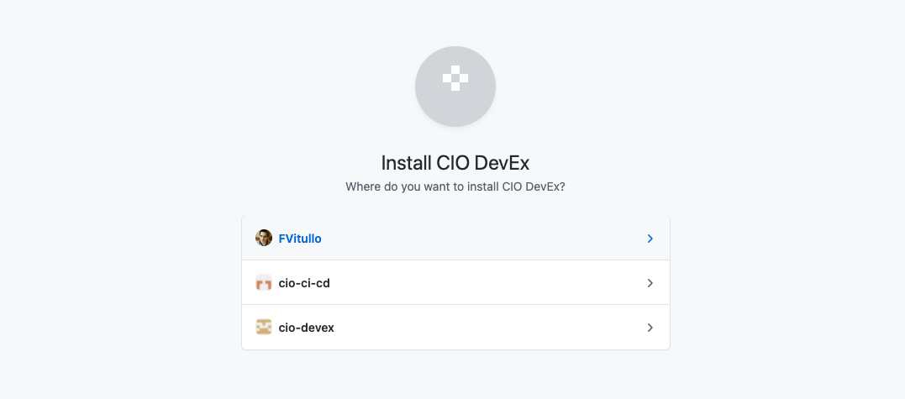
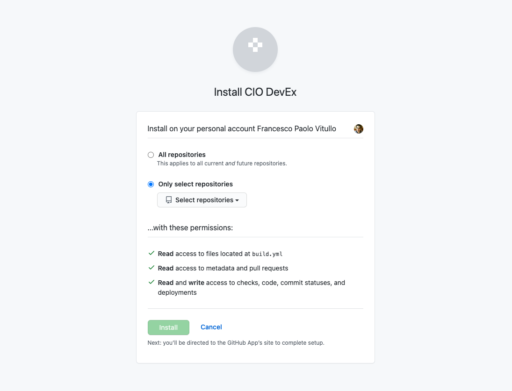

## GitHub App Installation

This page covers the basic process to install the GitHub application which is a requirement to work with the repositories. 

Make sure that you have [Owner permission](https://docs.github.com/en/get-started/learning-about-github/access-permissions-on-github#organization-accounts), or have someone with Owner permission approve this installation.

1. Go to the CIO DevEx GitHub App [installation page](https://github.ibm.com/github-apps/cio-devex/installations/new).

1. Select the organization to which you will push code.
   

1. Select all the repositories you work in. Note that you should create a build.yml for all repos you work in. 
   

1.  <a href="https://w3.ibm.com/enterprise-application-library" target="_blank">Register for an Enterprise Application Library (EAL) account</a>. (EAL-XXXXXX)

1. Create a build.yml file in project root with the following structure.
    



To get started on the pipelines, see the [Deciding on a Pipeline page](decision.md).