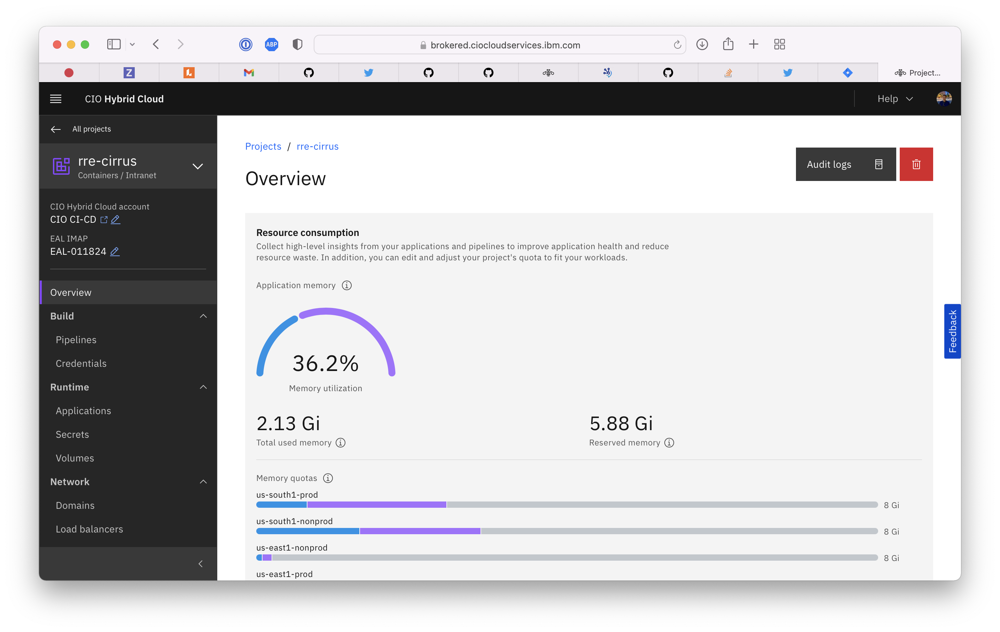

Enterprise Application Library (EAL) numbers are a LEGACY from when these IDs were hosted on [Decision Focus](https://ibm.decisionfocus.com/administrate/workspaces).

The new service, [Application Portfolio Management (APM)](https://w3.ibm.com/w3publisher/enterprise-application-library), hosts all the old EAL records and allows you to get new ones. Access the APM portal [here](https://ibm.service-now.com/home?id=apm_home).

If you are unable to find or determine the APM for your repository, contact your [Technical Owner](https://w3.ibm.com/w3publisher/dxhrfi/skills-guilds/technical-owner-guild).

Cirrus users can also locate their EAL number by navigating to the Cirrus project page and you should see the EAL-IMAP number on the top left of the page.
  

Configure the Enterprise Application Library (EAL) number in the build.yml file.

- Add the APM number to the build.yml such as in the following example:

      ```yaml
      apiVersion: automation.cio/v1alpha1
      kind: RepositoryConfig
      ealImapNumber: xxxxxx # HERE! Yes it says ealImapNumber, we haven't changed it yet
      build:
        strategy: cirrus-deployment
        pipeline: xxx
      ```
