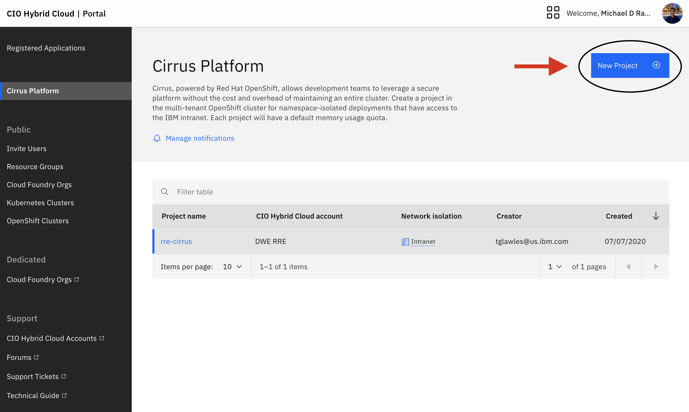
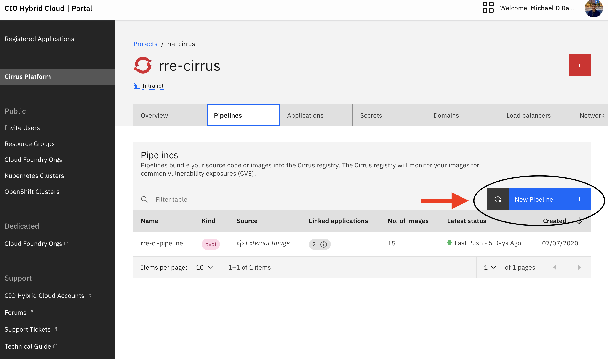

1. Go to [Cirrus](https://cirrus.ibm.com/).

1. Create a project in Cirrus. Give the project a name that makes sense. Choose **Containers** under Flavors.
   **Note**: If you already have a project and pipelines, you can also use your existing project and pipelines with CI/CD.
   

1. Navigate to the Pipelines tab and create a new pipeline. Select **CIO CI/CD pipeline**. Give the pipeline a name related to your project such as `<github_org_name>-<repository_name>`.
   
1. For your record, copy the credentials shown to somewhere safe when you click "Create pipeline". Take note of the **project name**.
