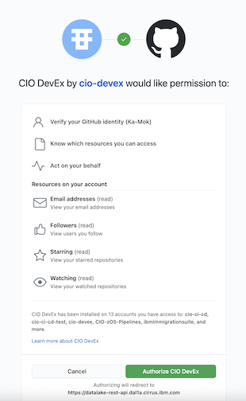

### Container Release: Deploy After Approval

This section outlines how your team with rights to deploy to production can perform that action after stakeholder review.
The team will invoke an API via the command line (or other tools, like insomnia) to deploy the application to **production**.

Visit this [link](https://datalake-rest-api.dal1a.cirrus.ibm.com/v1/integrations/ghes/login?headless=true){target=\_blank} in a web browser. You will get redirected to github.ibm.com to confirm your authorization for deployment. At the end of the redirect, you'll get a short-lived authorization code.



Exchange that code for a GitHub access token with this API request.

```bash
curl --location --request POST 'https://datalake-rest-api.dal1a.cirrus.ibm.com/v1/integrations/ghes/exchange' \
--header 'Content-Type: application/json' \
--data-raw '{
    "code": "xxx"
}'
```
With the response from the above request, send another API request. The access token expires after 8 hours.


In the following example, replace these variables with your own values:
??? "Variables Details"
    - **GITHUB-ORG**: Your GitHub organization name.
    - **GITHUB-REPO**: Your GitHub repository name.
    - **API-CODE**: The GitHub token you generated in the step above.
    - **PRODUCTION-VERSION-TAG**: Your production version tag that was committed into your default branch

```bash
curl --location -g --request POST 'https://datalake-rest-api.dal1a.cirrus.ibm.com/v1/repositories/<GITHUB-ORG>/<GITHUB-REPO>/releases' \
--header 'Content-Type: application/json' \
--header 'Authorization: Bearer <API-CODE>' \
--data-raw '{
  "environment": "production",
  "type": "container",
  "version": "<PRODUCTION-VERSION-TAG>"
}'
```


For more information regarding the API service and response details, visit this [link](https://datalake-rest-api.dal1a.cirrus.ibm.com/api#/Source%20Code%20Repositories/RepositoriesController_createRepositoryRelease) in a web browser.
