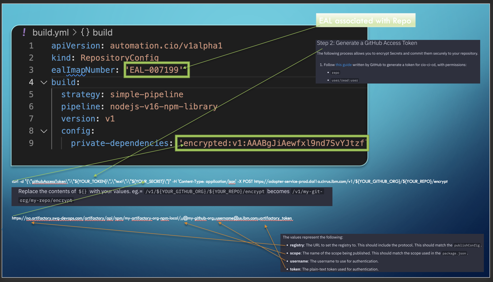

```bash
curl -d "{\"githubAccessToken\":\"${YOUR_TOKEN}\",\"text\":\"${YOUR_SECRET}\"}" -H 'Content-Type: application/json' -X POST https://adopter-service-prod.dal1a.cirrus.ibm.com/v1/${YOUR_GITHUB_ORG}/${YOUR_REPO}/encrypt
```

Replace the contents of `${}` with your values. eg.= `/v1/${YOUR_GITHUB_ORG}/${YOUR_REPO}/encrypt` becomes `/v1/my-git-org/my-repo/encrypt`


