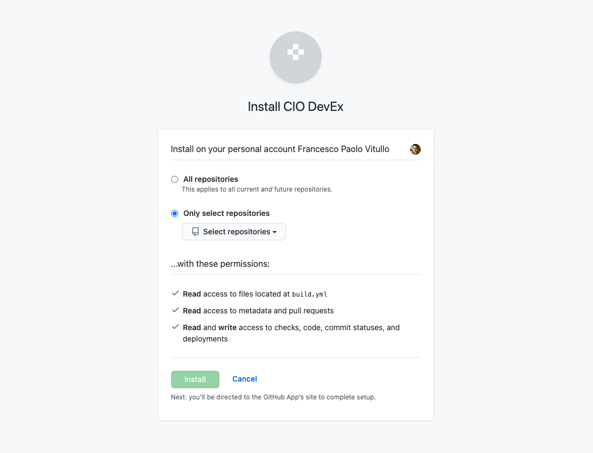

Make sure that you have [Owner permission](https://docs.github.com/en/get-started/learning-about-github/access-permissions-on-github#organization-accounts){target=\_blank}, or have someone with Owner permission approve this installation.

1. Go to the CIO DevEx GitHub App [installation page](https://github.ibm.com/github-apps/cio-devex/installations/new){target=\_blank}.

1. Select the organization to which you will push code.
   

1. Select the repository to which you will push code.
   