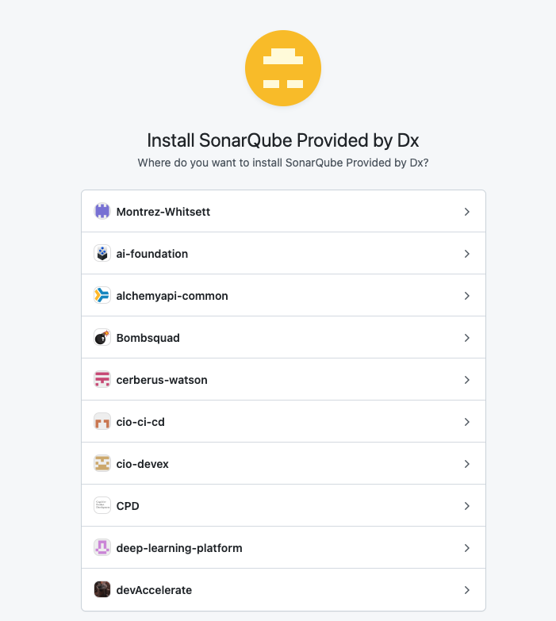
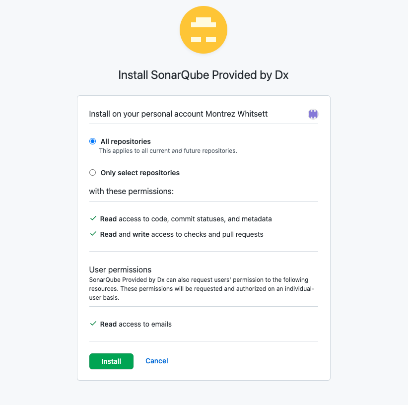

## Install the SonarQube GitHub Application

Make sure that you have [Owner permission](https://docs.github.com/en/get-started/learning-about-github/access-permissions-on-github#organization-accounts), or have someone with Owner permission approve this installation.

1. Go to the SonarQube Dx GitHub App [installation page](https://github.ibm.com/github-apps/sonarqube-provided-by-dx/installations/new).

1. Select the organization to which you will push code.
   
   
1. Select all repositories.
   

1. Create an access request with DX SonarQube by following their [guide](https://github.ibm.com/dx-sonarqube/dx-sonarqube/wiki/SonarQube-Access-Requests-for-Users#boarding-requests).