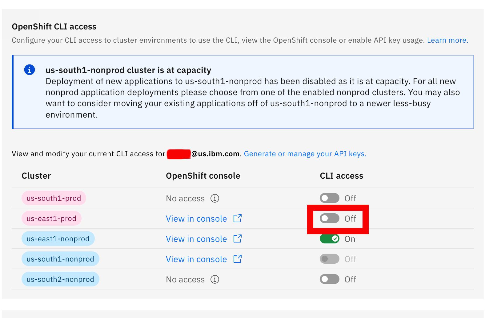
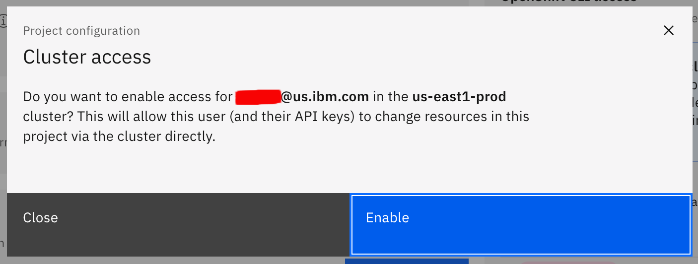
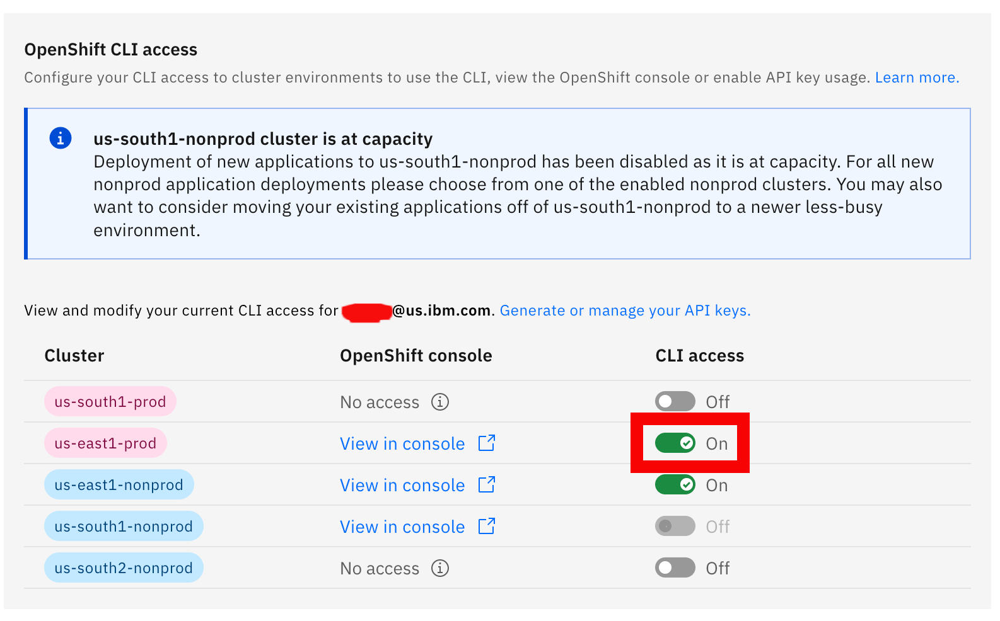

Grant the pipeline deployment privileges by enabling Openshift CLI access. In this example `us-east1-nonprod` has already been granted privileges. Now enable `us-east-prod` by clicking the slide bar next to it.

Confirm the username displayed is the same username used to deploy your pipeline.

Verify the CLI access button is now green next to your desired cluster.

