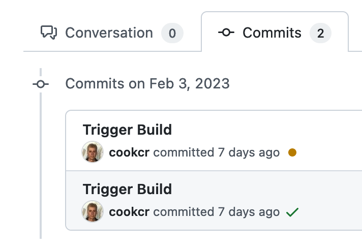
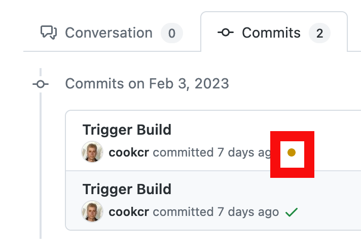

When you commit and push code changes from your feature branch on you local repository to github.ibm.com, the CIO CI/CD pipeline is triggered to build the code. Wait approximately one minute.

You can access the Checks page via your Pull Request, or the commits section of your branch.

!!! warning

    Concurrently running pipelines on the default branch may cause unexpected results or may result in a build failure. It is advised not to trigger multiple CI/CD pipelines at a given time.

See the following information about how the status is communicated:

1.  On the page for your PR, click on the **Commits** tab.
    

1.  This will show a list of commits for this pull request.
    

1.  Click on the icon you want to see the results for.
    

1.  Click on the **Details** link to learn more. Each Task has its own set of logs for your debugging purposes.
    

1.  Restarting a build

    If you need to restart a build, run the following command:

    ```bash
    git commit --allow-empty -m "Trigger Build"
    git push
    ```

    !!! note

        The "Re-run" button on the **Checks** page does not work.
