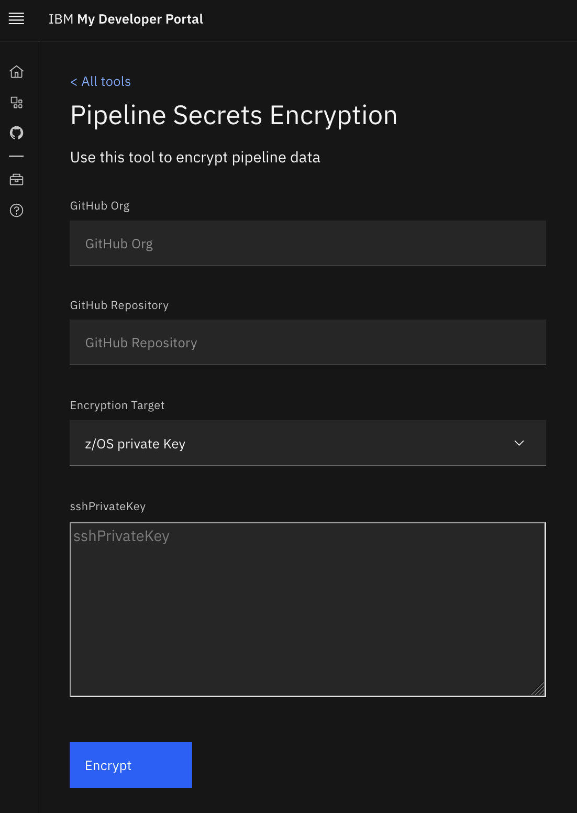
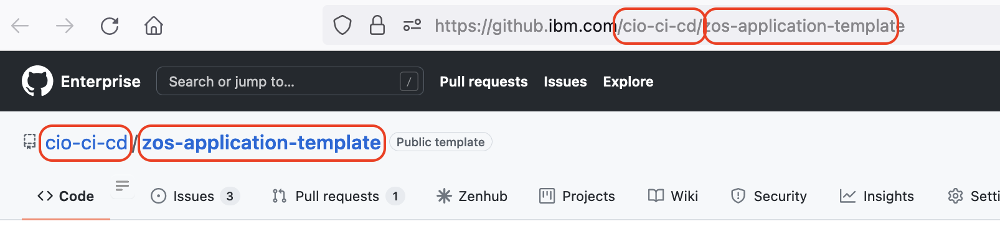

1. Click this link to the [Developer Tools](https://cirrus.ibm.com/developer/tools){:target="_blank"} section of the IBM My Developer Portal.  Then click on **Pipeline Secrets Encryption** which will land you on this form:

    { width="600" height="400" style="display: block" }

1. Keep this page open in your browser as you gather the necessary data to fill it with data from the steps below.

1. Obtain your **Github Org** and **Repository** names by opening a browser and navigating to the URL of the repository you created in [Repository Setup](../../zos/migration/repository-setup.md#creating-your-github-repository). In this **example**, the **Github Org** is "cio-ci-cd" and **Repository** "zos-application-template".  

    { width="600" height="400" style="display: block" }

1. Paste the **Github Org** and **Repository** names into the respective fields on the **Pipeline Secrets Encryption** page.

1. Choose **z/OS private Key** for the **Encryption Target**.

1. Next, you will use the ssh private key on your laptop [SSH Setup: Laptop to Github](../../zos/concepts/ssh.md#ssh-setup-laptop-to-github). 

1. Open a terminal on your laptop.  It will land you in your home directory.

1. Type `cd .ssh` to change into the `.ssh`. There you will find your public and private key pair.  Use the **private key** which is the one without `.pub` on the end. The steps in [SSH Setup: Laptop to Github](../../zos/concepts/ssh.md#ssh-setup-laptop-to-github) result in a private key named `id_rsa` which will be used going forward in these instructions.

1. Copy the contents of the **private key** into your clipboard.
    - Mac: Type `cat id_rsa | pbcopy` and press enter.
    - Windows: Type `type id_rsa | clip` and press enter.

1. Paste the contents of the private key into the **sshPrivateKey** field.

1. Click **Encrypt**.

1. In the next step you will create a **build.yml** file.  This build.yml template shows where the encrypted ssh parameters are located.  Create that file per the instructions and paste the encrypted parameters in the proper location.  Repeat the above steps for each environment you need to configure in your build.yml. 
