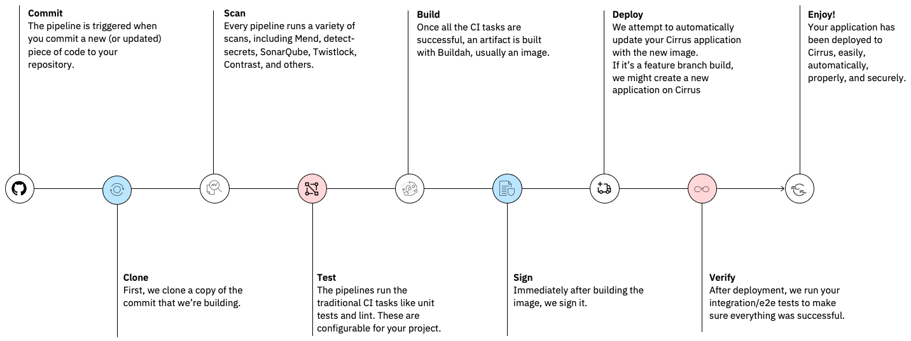

# Overview

Welcome to the technical documentation for the CIO CI / CD program. This web site contains information on the capabilities of the platform and instructions on how to configure a GitHub Enterprise repository to build and deploy applications using the CIO's CI / CD platform.

The CIO CI/CD pipeline is a custom-built DevSecOps solution, designed to enable CIO engineers to deploy software into the Cirrus platform as easily as possible, while still conforming to all the CIO specific requirements and regulations. The goal of the pipeline is to allow engineers and managers to concentrate on development while allowing automation to perform the toil of deployment.

While there are variations on how the pipeline operates, to match the specific technical and business requirements of different teams, the following diagram demonstrates the standard stages of the pipeline which virtually all types of pipeline will perform:

The following links will help you to start implementing your own pipeline:

  * [Distributed applications](requirements.md)
  * [z/OS applications](zos/overview.md)

The CIO CI/CD platform is an eternal work in progress. We welcome InnerSource contributions. For guidance on InnerSource opportunities, please see our [Pipeline Contributions](https://pages.github.ibm.com/cio-ci-cd/pipeline-catalog-docs/){target=\_blank} home page. 

If you have read the documentation and are still encountering issues, reach out to us on Slack:

- Distributed engineers:[#dx-platform-support](https://my.slack.com/archives/C02AM16DR19){target=\_blank}
- Mainframe engineers:  [#cio-zos-ci-cd-support](https://ibm-cio.slack.com/archives/C034Y7URH97){target=\_blank}

Contributing to the documentation:

- Follow our [InnerSource process](https://pages.github.ibm.com/cio-ci-cd/pipeline-catalog-docs/){target=\_blank} (using the `documentation` and `InnerSource` Github labels)
- Submit a [feature request](https://github.ibm.com/cio-ci-cd/pipeline-catalog/issues/new?assignees=&labels=enhancement&template=proposal.md&title=%5BFeature%5D){target=\_blank} (using the `documentation` Github label)

Periodically review the [Features and Roadmap](features-roadmap.md) to keep up to date on CIO CI/CD.
