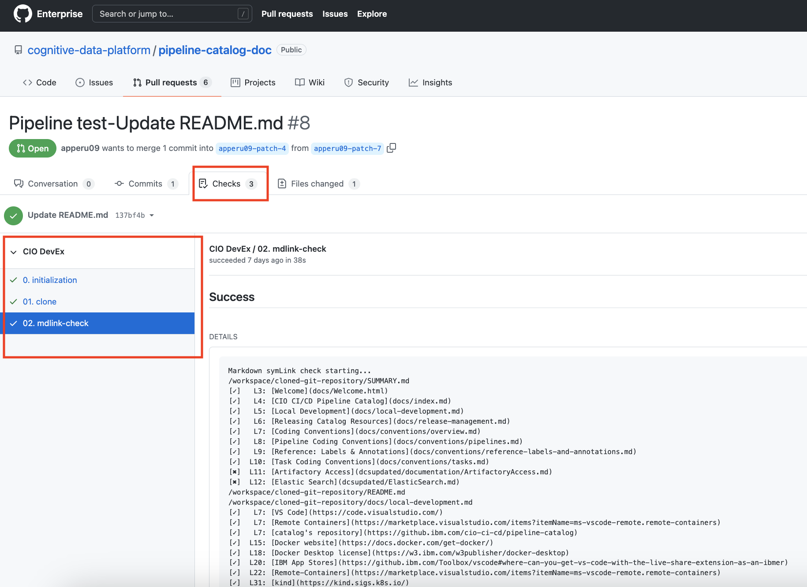
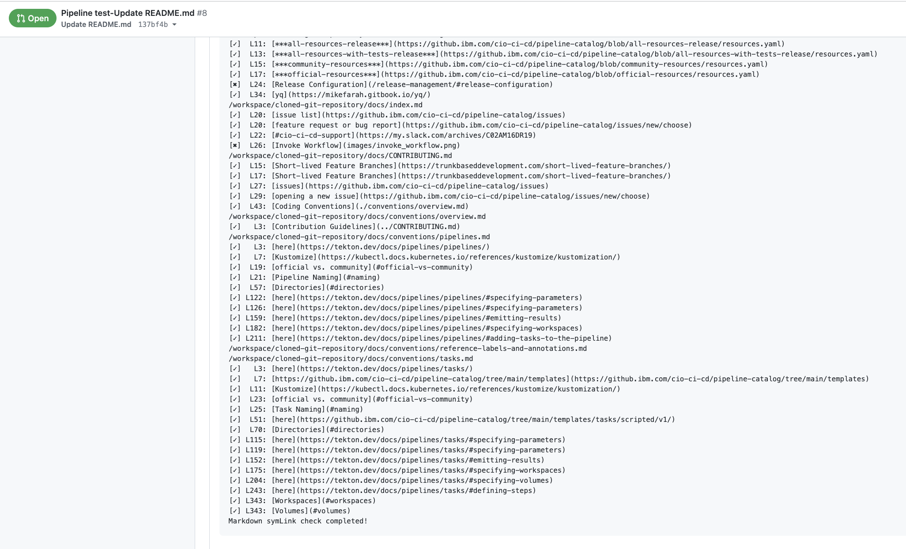

# Deploying mdlink-check Pipeline to your GitHub Repository

## mdlink-check Pipeline

mdlink-check is a generic pipeline for verifying the document symlinks within the repositories containing markdown (.md) files. The pipeline ensures that any newly created or existing markdown (.md) files in the repository do not contain broken/invalid symlinks. 

### How is it beneficial?
As you run this task or pipeline in your GitHub repository, it generates a build report. Using the you can effortlessly identify and rectify broken or invalid links, leading to significant time and effort savings.

This document describes the steps for integrating the "mdlink-check pipeline" into your GitHub repository. By the end of this document, you should be able to run mdlink pipeline for your GitHub repositories. Your repository should be set up such that every commit may trigger a build and deploy. 

## Install the GitHub Application





## Make Code Changes

Create a `build.yml` file in project root with the following structure. Some of the values will be filled out later.
      <!-- prettier-ignore -->

    ```yaml
    apiVersion: automation.cio/v1alpha1
    kind: RepositoryConfig
    ealImapNumber: xxxxxx
    build:
      strategy: simple-pipeline
      pipeline: mdlink-doc-library
      version: v1
    ```
 
  
## Push Code and Wait for Build
When you commit and push code changes from your feature branch on your local repository to github.ibm.com, the CIO CI/CD pipeline is triggered to build the code. Wait approximately one minute. You can access the Checks page via your Pull Request, or the commits section of your branch.

See the following information about how the status is communicated:

1. Open your Pull Request and click on **Checks** tab.
2. As you expand the **CIO DevEx**, it initiates the process of running mdlink check as shown below:
   
   
   
   
   
3. When the mdlink-check build runs successfully, you see logs as shown in above screenshot. Review the logs and identify the broken/invalid links which will be marked in [x] mark.

## Get Support

* If you require help in integrating the pipeline in your repository, reach out to the [CodeHub DevOps](https://chiefdataoffice.slack.com/archives/C3ERPD3TM) in your Slack workspace.
* You can also share your feedback/suggestion by clicking [here](https://chiefdataoffice.slack.com/archives/C3ERPD3TM). Your feedback helps us to improve the quality of this pipeline.
