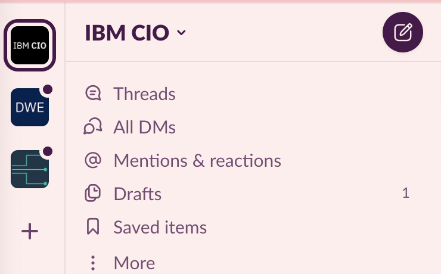
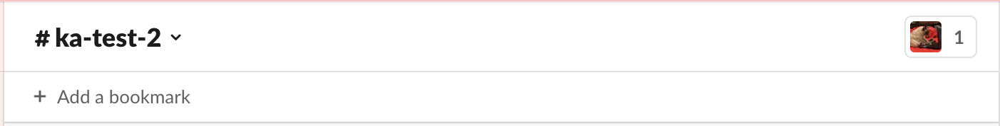
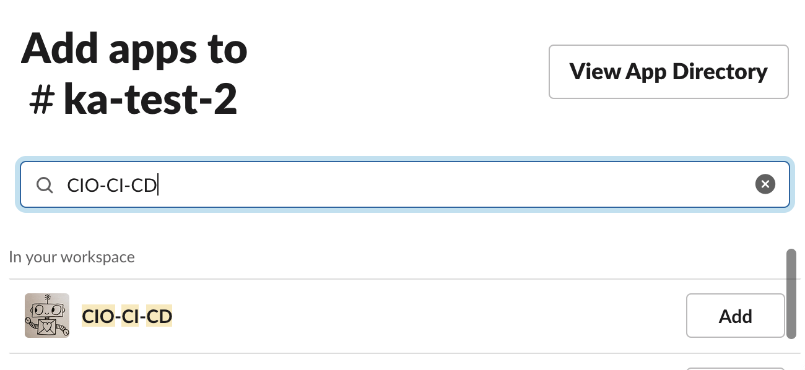
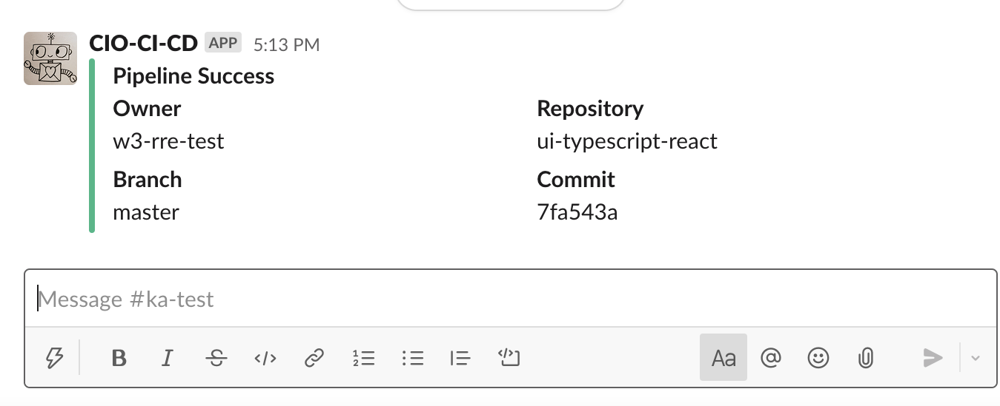

# Slack Notifications Setup

## Setup

Note: This is an optional process to configure Slack notifications from CIO CI/CD about your builds and deployments.

See the following process to install the Slack App CIO-CI-CD to your Slack channel:

1. On the left side of your Slack window, click on the IBM CIO workspace to make sure that you are in the supported workspace.
   
1. Click on the channel that you are setting up to send notifications to.
1. On your Slack channel, click on the down arrow next to the channel name to open the channel settings window.
   
1. Click the **Integrations** tab and click **Add apps**.
   
1. Search for the CIO-CI-CD app and click the **Add** button.
     
   You should see the following notification in your Slack channel.
   

## Specifying the Channel in your Repository Config

Add a top level field called `notifications`, and a sub level called `slackChannel` with the channel name where you have installed the Slack app CIO-CI-CD to receive notifications.

```yaml
apiVersion: automation.cio/v1alpha1
kind: RepositoryConfig
ealImapNumber: xxxxxx
notifications:
  slackChannel: xxx
```

## Technical Support

You are all set up to receive important updates about your build and deployments. 
