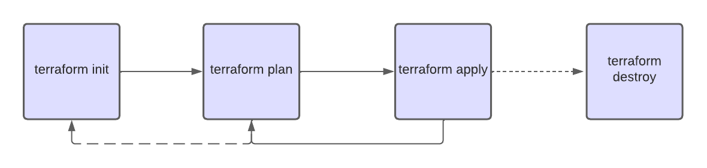
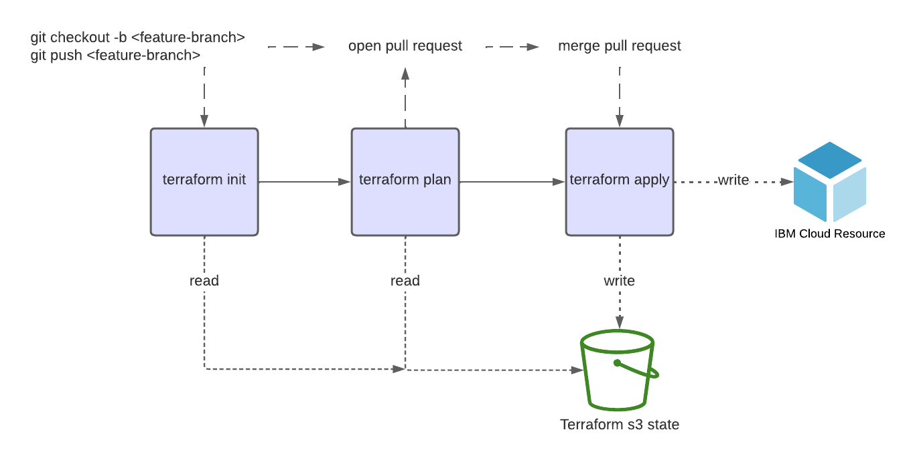

# Overview

This page provides an overview of Hashicorp Terraform including core concepts and the general workflow it runs to provision resources in the targeted infrastructure.

## Terraform

Terraform is an open source **Infrastructure as Code** tool, created by HashiCorp.

A declarative coding tool, Terraform enables developers to use a high-level configuration language called **HCL (HashiCorp Configuration Language)** to describe the desired *end-state* cloud or on-premises infrastructure for running an application. It then generates a plan for reaching that end-state and executes the plan to provision the infrastructure.

Because Terraform uses a simple syntax, can provision infrastructure across multiple cloud and on-premises data centers, and can safely and efficiently re-provision infrastructure in response to configuration changes, it is currently one of the most popular infrastructure automation tools available.

## Infrastructure as a Code (IaC)

IaC allows developers to codify infrastructure in a way that makes provisioning automated, faster, and repeatable. It’s a key component of Agile and DevOps practices such as version control, continuous integration, and continuous deployment.

Infrastructure as code can help with the following:

  - **Improve speed**: Automation is faster than manually navigating an interface when you need to deploy and/or connect resources.

  - **Improve reliability**: If your infrastructure is large, it becomes easy to misconfigure a resource or provision services in the wrong order. With IaC, the resources are always provisioned and configured exactly as declared.

  - **Prevent configuration drift**: Configuration drift occurs when the configuration that provisioned your environment no longer matches the actual environment.

## Terraform workflow

Terraform core workflow consists of lifecycle stages **init**, **plan**, **apply**, and **destroy**. These stages are executed as commands to perform the operation expected by them.

- **Terraform init**. Runs a number of initialization tasks to enable Terraform for use in the current working directory. This is usually executed only once per session.

    ``` bash
    $ terraform init
    ```

- **Terraform plan**. Compares the desired Terraform state with the current state in the cloud and builds and displays an execution plan for infrastructure creation or destruction. This command is just for the creation of a plan for you to verify/review the work done by you and your teammates; it does not change the deployment. So, you can update the Terraform configuration if the plan is not as per your requirements.

  `$ terraform plan`

- **Terraform apply**. Executes the plan that is created, comparing the current and desired states. This will create or destroy your resources, which means it potentially changes the deployment by adding or removing resources based on changes in the plan. Terraform apply will run the plan command automatically to execute the most recent changes. However, you can always tell it to execute a specific terraform plan command by providing a plan file.

    ``` bash
    $ terraform apply
    ```

- **Terraform destroy**. Will delete all resources that are created/managed by the Terraform environment you are working in.

    > **NOTE:** this stage is not considered as part of the regular execution steps since is inteded for the destruction of the whole Terraform environment.
    ``` bash
    $ terraform destroy
    ```
This Diagram, describes the general workflow of Terraform:



### CI/CD workflow

This diagram is a high-level oerview of the workflow executed as part of the pipeline execution:




## Terraform providers

Terraform providers are plugins that implement resource types. Providers contain all the code needed to authenticate and connect to a service—typically from a public cloud provider—on behalf of the user. You can find providers for the cloud platforms and services you use, add them to your configuration, and then use their resources to provision infrastructure. Providers are available for nearly every major cloud provider, SaaS offering, and more, developed and/or supported by the Terraform community or individual organizations.