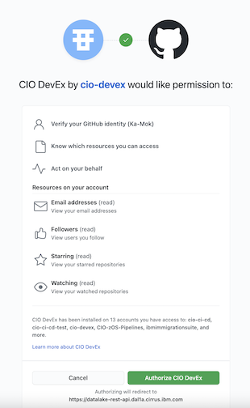

### Step 5: Deploy after Approved

When your PR is approved you may deploy it to a production (or lower) environment through an API request. This diagram shows the approval workflow and where the actors would trigger the deploy pipeline. 


#### 5.1. Get Deployment Authorization
	
Visit this [link](https://datalake-rest-api.dal1a.cirrus.ibm.com/v1/integrations/ghes/login?headless=true) in a web browser. You will get redirected to github.ibm.com to confirm your authorization for deployment. At the end of the redirect, you'll get a short-lived authorization code.

First time in you should see this: 
	



Click the authorize button. You’ll get this: 
	

	
	
Press the Copy button to put the code into the clipboard. 

#### 5.2. Exchange that code for a GitHub access token with this API request. 

*We recommend building the commands in a text editor to make the parameter substitutions, and copying/pasting them into your terminal to run them.*

Replace "xxx" with the code you copied above before submitting the command (retain quotes): 

```bash
curl --location --request POST 'https://datalake-rest-api.dal1a.cirrus.ibm.com/v1/integrations/ghes/exchange' \
--header 'Content-Type: application/json' \
--data-raw '{
    "code": "xxx"
}'
```


This will return a GitHub token. 

#### 5.3. Create API Command using Environment Parameter
	
With the token from the above request, create another API request. Make the following substitutions before running the command.
 
* Replace xxx with the token received from the above command (no quotes).
* Replace "feature" with the name of your feature branch (retain quotes).
* Replace "my-production-environment" with the name of the target environment in your project’s YAML (retain quotes).

```bash
curl --location -g --request POST 'https://datalake-rest-api.dal1a.cirrus.ibm.com/v1/repositories/{my-github-org}/{my-github-repo}/releases' \
--header 'Content-Type: application/json' \
--header 'Authorization: Bearer xxx' \
--data-raw '{
  "branch": "feature",
  "environment": "my-production-environment"
}'
```


#### 5.4. Trigger Pipeline Via API Request

Copy, paste and run the API command created in the prior step. 

The above command triggers a deploy pipeline for the latest commit of feature branch to the environment named my-production-environment. The my-production-environment is denoted, with the required authentication credentials, in the build.yml file in your repository.

#### 5.5. Validate the deployment.
	
In GitHub, look under the GitHub Checks for the specific commit that is being deployed. 

