# Creating Pipeline Functional IDs Using CLAS

CLAS is the tool on Cirrus 1.0 systems for user ID and group identity management.  This tool requires IDs and groups to have owners.  The owner’s IBM serial number is necessary for the steps listed below.  

!!! note
    Management approval is required for user ID and group management.  Contact the owner’s manager in advance so they are available for approvals and familiar with the tool.

The CLAS tool is a z/VM based application.  To do the following steps, you will need an ID on LAVM1: `lavm1.boulder.ibm.com`.  

1) Log into LAVM1 using a 3270 emulator:

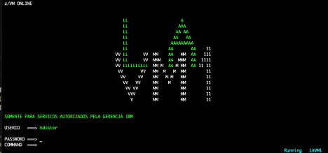 

2) Start CLAS by running `CLAS`:

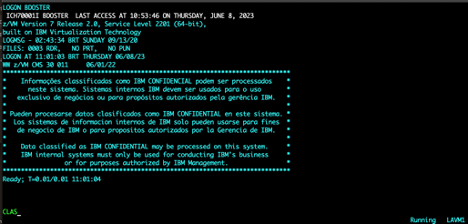 
 
3) Create a new ID by selecting option 2:

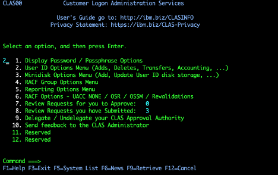 
 
4) Choose option 2, “Add User ID Selecting Features”:

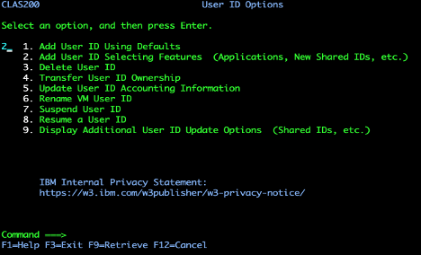 

!!! note
    The user ID needs to be owned by an IBM employee. Have the owner's IBM Serial Number available before proceeding with the next step.

5) Enter the Serial Number, ID Name, and the system this ID is being created for in this next window:

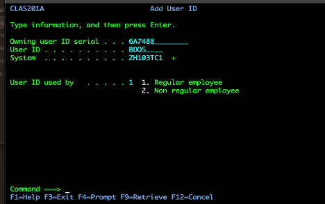 
 
6) Add TSO and then display other options.  1 for TSO and then 2 for Display options:

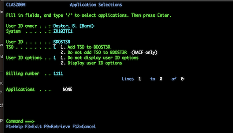 

7) Choose option 1 to create more than one ID on the same system or optionally chose option 2 to create the same ID on different systems:

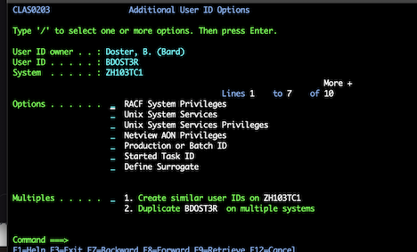 

8) Creating a RACF group for these IDs:

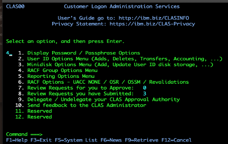 
  
9) Once ID is created, add the user to your RACF group, if you have one.  Option 1 describes how to create the group if you have not done so yet:

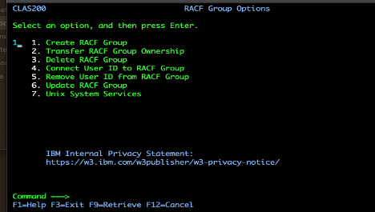 
 
10) Provide an the owner for the group with the serial number noted above and enter the group name and system:

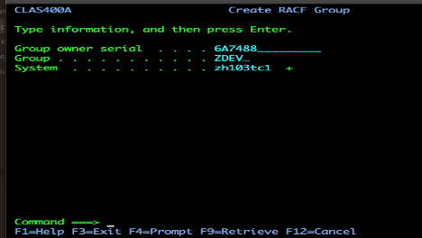 
 
11) Enter RACF owner: a group or user that is already in CLAS. Once you hit enter this will be sent to the owner’s manager for approval:

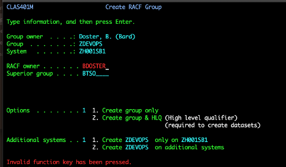 
 
Upon completion, additional users can be added to this group providing them read access to all of the datasets and z/OS Unix files.