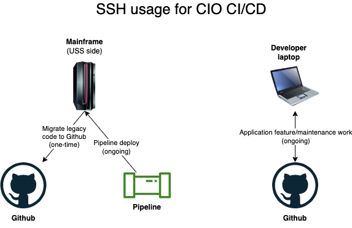
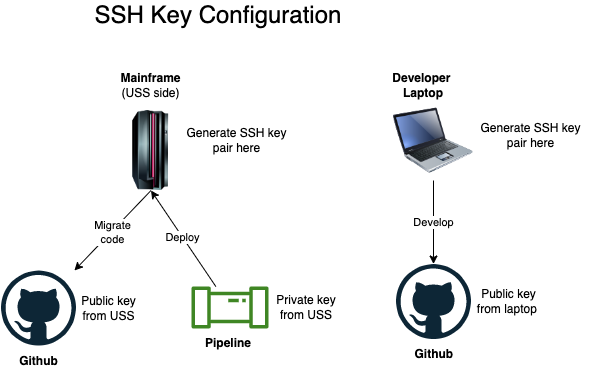

# SSH

With CIO CI/CD, your source code will reside in [IBM's enterprise Github](https://github.ibm.com){target=\_blank}.  To onboard onto the pipeline and perform your daily development activities, you will need to create connections across environments for three purposes:

- Onboarding

    1) Setting the pipeline for deploying code to your target z/OS environments

    2) Migrating your legacy code to Github

- Local Development

    3) Creating a connection between Github and your laptop

This diagram outlines the usage of SSH for CIO CI/CD.  You will need to configure an SSH connection between USS and Github (one-time use for migration), USS and the Pipeline (ongoing use for deployment) and your laptop and Github (ongoing use for feature development and maintenance).

{ width="600" height="400" style="display: block; margin: 0 auto" }

### Understanding SSH
Github uses [SSH "Secure Shell"](https://www.ssh.com/academy/ssh/public-key-authentication#public-key-authentication---what-and-why?){target=\_blank}, a network communication protocol that **enables two computers to communicate without password authentication**.  To understand it in detail, read the above link, however, you may proceed with the basic understanding that ssh is a protocol that connects two environments without having to use a password.

### Configuring SSH
Your USS environment on z/OS must contain the tool [ssh-keygen](https://www.ssh.com/academy/ssh/keygen){target=\_blank} from your [LPAR setup](./../migration/lpar-setup.md).  This tool generates a public and private key pair.  Copying the public key to Github establishes an ssh connection between these environments

The same approach applies to seeing up a connection between your laptop and Github.  Generate another set of ssh keys by running [ssh-keygen](https://www.ssh.com/academy/ssh/keygen){target=\_blank} on you laptop. Copying the public key to Github establishes a ssh connection between these two environments.

Finally, the pipeline needs to deploy the build artifacts to your z/OS machine.  The private key from the key pair generated on your USS machine is used for this step. It is encrypted and added to the configuration of your pipeline.

This diagram depicts the flow of the keys for migration and ongoing development and deployment:

{ width="600" height="400" style="display: block; margin: 0 auto" }

### Steps to configure SSH

#### Copy public ssh key to Github
Some steps below involve copying a public ssh key to Github. Follow these instructions replacing `<PUBLIC_KEY>` with the public ssh key you generate using the `ssh-keygen` command:

1. Open a browser and log into [https://github.ibm.com](https://github.ibm.com){target=\_blank}.
1. Click your profile picture in top right -> then Settings -> then SSH and GPG keys -> then click New SSH key. This does not create a new key in Github rather a place to store your public key.
1. Copy the contents of the **public key** into your clipboard.
    - Mac: Type `cat ~/.ssh/id_rsa.pub | pbcopy` and press enter.
    - Windows: Type `type ~/.ssh/id_rsa.pub | clip` and press enter.
    - zOS/Unix/SSH: type `cat ~/.ssh/id_rsa.pub` and press enter, then copy the output of this command.
1. Paste the contents of the public key into the text box on Github and click save.

#### SSH Setup: Laptop to Github
1. Log into your laptop and open a terminal to your home directory.
1. Run `ssh-keygen` to generate a key pair on machine on your local machine (i.e. laptop).  Be sure to leave the passphrase empty.
    ```
    $ ssh-keygen -t rsa -b 4096 -o -a 100
    Generating public/private rsa key pair.
    Enter passphrase (empty for no passphrase):
    Enter same passphrase again:
    Your identification has been saved in id_rsa
    Your public key has been saved in id_rsa.pub
    ...
    ```
    This will create two files: `id_rsa.pub` public key file and `id_rsa` private key file.
1. Change into the `.ssh` directory (`cd .ssh`).  There you will find `id_rsa.pub` and `id_rsa`.
1. Use the [Copy public ssh key to Github](#copy-public-ssh-key-to-github) instructions above to copy the contents of `id_rsa.pub` to Github.
1. Test your setup using these instructions from Github: [Testing your SSH connection](https://docs.github.com/en/enterprise-server@3.5/authentication/connecting-to-github-with-ssh/testing-your-ssh-connection){target=\_blank}.

#### SSH Setup: USS to Github
1. Log into the USS side of your z/OS system and stay in your home directory.
1. Run `ssh-keygen` to generate a key pair on machine on your local machine (i.e. laptop).  Be sure to leave the passphrase empty.
    ```
    $ ssh-keygen -t rsa -b 4096 -o -a 100
    Generating public/private rsa key pair.
    Enter passphrase (empty for no passphrase):
    Enter same passphrase again:
    Your identification has been saved in id_rsa
    Your public key has been saved in id_rsa.pub
    ...
    ```
    This will create two files: `id_rsa.pub` public key file and `id_rsa` private key file.
1. Change into the `.ssh` directory (`cd .ssh`).  There you will find `id_rsa.pub` and `id_rsa`.
1. Use the [Copy public ssh key to Github](#copy-public-ssh-key-to-github) instructions above to copy the contents of `id_rsa.pub` to Github.
1. Test your setup using these instructions from Github: [Testing your SSH connection](https://docs.github.com/en/enterprise-server@3.5/authentication/connecting-to-github-with-ssh/testing-your-ssh-connection){target=\_blank}.

#### SSH Setup: Pipeline (and laptop) to USS
The pipeline deploys artifacts to USS using SSH. To make this connection, the private key from your laptop is encrypted and placed in the pipeline configuration and the public key is placed on USS.  The public and private key pair from your laptop are used instead of the pair from USS because it is easiest to add the private key from your laptop to the pipeline configuration.

**Key point**: An ssh key pair generated on one computer can be used to create a connection between two different computers.

The steps to configure the private key exist in the pipeline setup instructions.  For example [Make Code Changes](../pipelines/zos-traditional.md#step-3-make-code-changes) for the Traditional z/OS applications.

The following instructions are the steps to copy the public key on USS.  The public key is placed in a new `authorized_keys` file.

1. Mac users: from your home directory on your laptop, run `ssh-copy-id -i ~/.ssh/<PUBLIC KEY> <USER>@<HOST>` where:
    - `<PUBLIC_KEY>` is the file in the `.ssh` directoy that ends in `.pub`
    - `<USER>` is your USS user ID
    - `<HOST>` is the host name or IP of the USS side of your z/OS machine
1. Windows users: from your home directory on your laptop using PowerShell, run:
    ```
    type .ssh\<PUBLIC_KEY> | ssh <USER>@<HOST> "mkdir -p ~/.ssh; cat >> ~/.ssh/authorized_keys"
    ```
    The variables are the same as the ones above for Mac.
1. Test the copy by typing `ssh <USER>@<HOST>` from your laptop.  Your terminal should show that you are now in USS.

**Key point**: Your USS password is no longer required to access USS from your laptop.  Type `ssh  <USER>@<HOST>` going forward.
