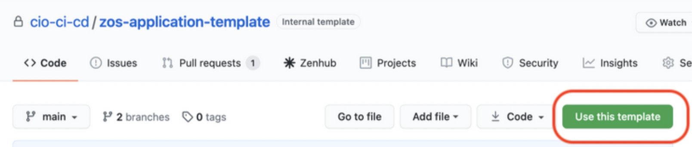
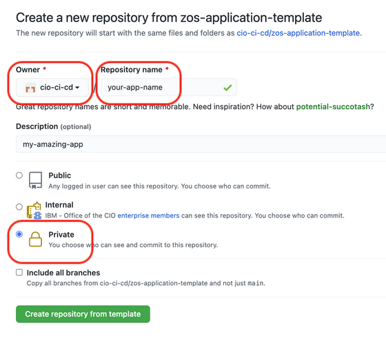
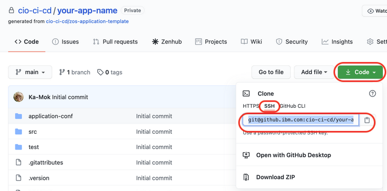
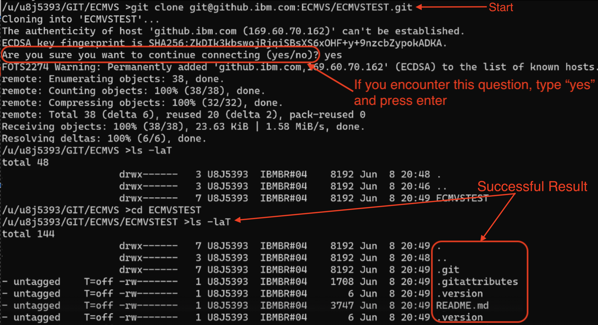

# Repository Setup





The CIO z/OS Application Pipeline requires your Github repository to be structured in a specific way. This guide walks you through the steps of creating your GitHub repository.  This is a one-time task for setup and involves creating the repository on your z/OS Unix Systems Services (USS) where you can obtain your legacy source code and upload it to IBM Github.  After this task is done, ongoing development will be done on your local machine.

## Creating your Github Repository
One piece of functionality in Github is the Template Repository.  This is often used to build a foundation so that team members do not need to repeat common configuration and setup steps for their applications.  When a repository in Github is configured as a template, a button appears on its Code tab called "Use this template".  We have put together a template repository that is your foundation in code for your application.

1. Create a Github Organization if you do not have one already.  Follow this link to create your organization: [Creating a new organization](https://docs.github.com/en/organizations/collaborating-with-groups-in-organizations/creating-a-new-organization-from-scratch){target=\_blank}.
<br><br>

1. Open a browser and navigate to the template: [template repository](https://github.ibm.com/cio-ci-cd/zos-application-template){target=\_blank}.
<br><br>

1. Click **Use this template** to start the process.
<br><br>
    
<br><br>
3. In the following form, set the following parameters based on your application:

    - **Owner** -> this is not the literal person who is the owner rather is the name for the Github Organization.
    - **Repository name** -> this is the name for your application
    - **Description** -> optional
    - **Private / Public** -> set this to private unless you have been made aware that it is public
    - **DO NOT CLICK** the "Include all branches" check box
<br><br>
    

## Clone your Repo to z/OS Unix Systems Services
​
Now you have created your repository in IBM Github and it's time to work with it on your Z machine. 

1. Using your shell, log into USS.

1. Create a folder called `migration`.
```
mkdir migration
cd migration
```

1. Open a browser and navigate to the repository you created in the above section [Creating your Github Repository](#creating-your-github-repository).

1. If you are not on the tab already, click "Code" in the list of tabs at the top (-->"Code"<-- "Issues" "Pull Request"...).

1. Click the "Code" button on the right to get the URL.  Make sure you chose "ssh"
<br><br>

<br><br>
Your URL should look like this:
```
git@github.ibm.com:cio-ci-cd/your-app-name.git
```

1. Return to your shell with the cursor in the `migration` directory and clone the repository from Github to that folder location.
    1. Construct the clone command by starting it with `git clone` then adding your URL on to the end.  Your command will look like this:
    ```bash
    git clone git@github.ibm.com:cio-ci-cd/your-app-name.git
    ```
    1. Run the command in your shell.
    1. If you receive the following message where, type `yes` and press enter.
    ```
    The autenticity of host 'github.ibm.com(169.60.70.162)' can't be established
    ECDSA key fingerprint is SHA256:<MESSAGE SHOWS FINGERPRINT HERE>
    Ar you sure you want to continue connecting (yes/no)?
    ```
    1. Clone will complete with a message like: `Resolving deltas: 100%`
    1. Verify the clone by typing `ls -la` and pressing enter.  You should see output like the following:
    ```
    .git
    .gitattributes
    .version
    README.md
    ```

    This is a screen capture representing the above steps:
    <br></br>
    

## Configure $HOME in .profile

In order for the zos application pipeline to work, the `$HOME` variable must exist and equal the home directory of your USS user. You need to set `$HOME` in the [.profile](https://www.baeldung.com/linux/bashrc-vs-bash-profile-vs-profile#3-significance-of-profile) file which contains commands that are executed during startup of processes such as your shell/terminal in the Unix environment.  

It is likely by this point that you have the `.profile` file on your USS with numerous configurations in place.  Open the file and add this command if it does not already exist: 
```
...
export HOME=<HOME_DIRECTORY>
...
```

Three dots `...` represent other commands that may already exist in the file.  Do not change them.  

`<HOME_DIRECTORY>` is the directory that appears in your terminal when you log in.  For example, in this screen shot of a terminal window, the home directory is `/u/u8j5393`: 


Following this example, the export command to add to the `.profile` file is:
```
...
export HOME=/u/u8j5393
...
```