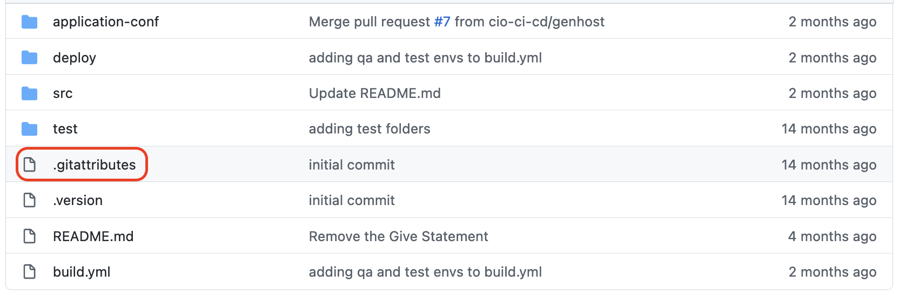
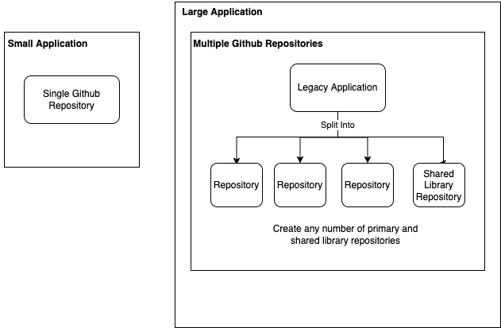

# Source Migration



There are three legacy source locations for code that this page addresses. Navigate this page as follows:

1. Understand how to perform the code page conversion.

1. Design your Github repository structure.

1. Choose your source from the following list which contain the steps to copy your source code into your new Github repository.  

    - [SCLM](#migrating-your-source-from-sclm-to-github)
    - [DEM](#migrating-your-source-from-dem-to-github)
    - [PDS](#migrating-your-source-from-pds-partitioned-data-set-to-github)

1. After your source is migrated, [push your code to Github](#push-code-to-github).

1. [Customize your application-conf](#customize-your-application-conf).

## Code Page Conversion
The code page conversion needs to be done correctly. Read pages 11 through 24 in the [Managing the code page conversion when migrating z/OS source files to Git](https://www.ibm.com/support/pages/system/files/inline-files/Managing%20the%20code%20page%20conversion%20when%20migrating%20zOS%20source%20files%20to%20Git%20-%201.0.pdf) guide.  

In the [same guide](https://www.ibm.com/support/pages/system/files/inline-files/Managing%20the%20code%20page%20conversion%20when%20migrating%20zOS%20source%20files%20to%20Git%20-%201.0.pdf), read page 6 section 2.4 to manage non-roundtripable characters.

Common EBCDIC code pages are 1037 and 1047.  EBCDIC 1047 is probably correct for PL1¬. The default in the **.gitattributes** file of the repository you created from the template is 1037.  Be sure to get the code page setting correct for your application.

{ width="600" height="400" style="display: block; margin: 0 auto" }

## Design your Github repository structure
Before you migrate, design a Github structure to ensure your legacy build and deployment capabilities will work within Github.  Simple utilities can be migrated to a single Github repository.  Large ones need to be split across multiple repositories for the utilities and shared libraries.

The goal of the repository is to keep related files together that depend on each other or that are commonly worked together.  For z/OS build process, it is OK to split a single application into multiple repositories.
	
First consider any shared copybooks or includes. If any other team/application uses your copybooks/includes they should be split out into their own repository so the other team can easily access those files from a single repository without having to work with code that is unrelated to their project.

Second think about the number of files that need to belong together.  Dealing with folders that contain thousands of files is difficult.  Carefully think through the number of files in each individual folder and ensure that it will be easy for developers to use in that folder structure.

The goal is to make the repositories usable by the developers.  Repositories with large numbers of files over 5000+ can get slower and be harder to deal with.  There is no specific rule that it won't work. 

Another best practice is to split static files that have not been changed in years into a separate repository and keep frequently changed files in other repositories.  This makes it easier to work with the frequently changing files.

Usability is a primary consideration in the migration. Keep in mind the benefit of smaller repositories.  Migration is an opportunity to create environments that are easier to work in.

You should put the files into language specific folders. An example of this can be found [here](https://github.ibm.com/cio-ci-cd/zos-application-template/tree/main/src/main){target=\_blank}.  Notice, the standard structure puts your source into `<repo>/src/main/<language>`. We define our repos in this structure to maintain consistency needed to run the pipeline.



---



---



---




