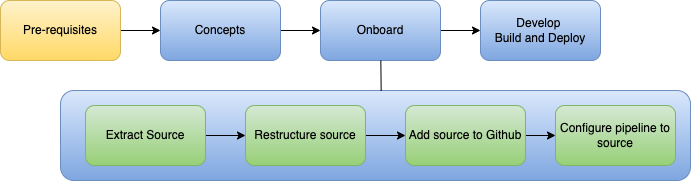

# Overview

This page provides an overview of the onboarding flow for z/OS.  There are unique tools you need to install and concepts to understand to start the onboarding process.

This diagram is an overview of the path you will take to migrate to Github and  high-level view of the path you will take:



Note the following:

- When you start your pre-requisites, be sure to verify [language (file type) support](#language-file-type-support) first to mitigate spending a large amount of effort without being able to board.
- **Restructuring** source requires thought.  The onboarding documentation provides a **template** for how it is organized in the target environment.  Migrating to that template will require a **different style of thinking**.  We have staff available to **assist** in this and all of your efforts using CIO CI/CD on **Slack**:

<div align="center"><a href="https://my.slack.com/archives/C034Y7URH97" target="\_blank"><b>#cio-zos-ci-cd-support</b></a></div>

- If your language / file type is supported, **proceed** with the [prerequisites](#prerequisites).  You will need to wait for some setup during which time you can study the concepts starting with [CLAS Identity Management](./concepts/clas-identity-management.md), [SSH](./concepts/ssh.md), [Git and Github](./concepts/git-and-github.md), and [USS Shell and Terminal](./concepts/uss-shell-terminal.md).  **Be sure to go through these Concepts before proceeding to Onboarding**.

- **You are free to experiment** with the migration.  There is **nothing harmful** in this process.  You may create repositories in Github, delete them and **try over as many times as you wish**.  


## Prerequisites

### Language (file type) support
Review the language (file type) support section of the Features and Roadmap page: [Native z/OS Types](../features-roadmap.md#native-zos-types).  Ensure your language is supported. Check this first to prevent spending a large amount of time finding you are unable to board the pipeline.  If one of your file types is not supported, create a [feature request](https://github.ibm.com/cio-ci-cd/pipeline-catalog/issues/new?assignees=&labels=enhancement&template=proposal.md&title=%5BFeature%5D).

### Developer
Migrating your application from a traditional mainframe environment and the z/OS Application Pipeline leverage specific tooling that may be new to mainframe application developers.  For onboarding applications, teams should begin learning the following tools listed below.  Some of these tools will be used for the migration, and others for day-to-day development once the pipeline is setup.

-   [Git & Github](./concepts/git-and-github.md)
-   [SSH](./concepts/ssh.md)
-	[IDz Eclipse](https://www.ibm.com/docs/en/developer-for-zos/14.1?topic=systems-installing-idz-client){target=\_blank} or [VSCode](https://www.digitalocean.com/community/tutorials/how-to-use-git-integration-in-visual-studio-code){target=\_blank}

### LPAR 
The following tools will be installed by the infrastructure team. If they are not, make sure your LPAR is in queue to have them installed by sending a message to the support channel [#cio-zos-ci-cd-support](https://my.slack.com/archives/C034Y7URH97){target=\_blank} in the following format, supplying your app's name, the hostnames/LPARs you will need the tools installed on, and what their roles are (dev/test/prod):


> ATTN AppMod: Our app `AppName` is beginning the migration process onto the pipeline. Please have infrastructure install the necessary tools on:
> 
> ```
> Hostnames:
> 
> LPARs:
> 
> Sysplex:
> 
> ```

-	Git
-	DBB toolkit v2.0
-	Dbb-zappbuild
-	Python
-	Curl
-	Plum
-	Plum modules
-	Openssl
-	zOAU v1.2

Unfortunately, not all the tools can be installed in this method.  The following tool will need to be provided by your z/OS hybrid cloud team. 

-	Java 8 64bit

!!! note
    We are currently developing a ticketing process to request and install the above tools.  Check this page in the next coming weeks for details.

## Setting up User IDs

### Developer User Setup

-	[Setup SSH keys between laptop and GitHub](./concepts/ssh.md#ssh-setup-laptop-to-github)
-	[Setup SSH keys between laptop and LPAR](./concepts/ssh.md#ssh-setup-pipeline-and-laptop-to-uss)
-	[Setup SSH keys between LPAR and Github](./concepts/ssh.md#ssh-setup-uss-to-github) (to aid with migration)
-	[Setup `~/.profile` to setup required migration tools](./migration/lpar-setup.md#step-3-configure-necessary-applications-and-commands-on-your-cicd-lpar)

### Pipeline User Setup
-	[Request IDs via CLAS](./concepts/clas-identity-management.md)
-	Create a user ID for each target env (Dev / Test / Prod / Etc)
-	[Setup SSH keys between LPAR and pipeline](./concepts/ssh.md#ssh-setup-pipeline-and-laptop-to-uss)
-	[Setup ~/.profile to setup required pipeline tools](./migration/lpar-setup.md#step-3-configure-necessary-applications-and-commands-on-your-cicd-lpar)

This overview on user setup pertains to the [LPAR Setup](./migration/lpar-setup.md) section in the onboarding documentation.

## After Prerequisites

After you complete the prerequisites, you will be ready to migrate your source to Github, board a pipeline and develop, build and deploy your application.

### Migrate

Go through each step in the migration folder of this docmentation starting with [Repository Setup](./migration/repository-setup.md).  These pages walk you through how to create your repository in Github, migrate your source code and set up your LPAR.  Be sure to understand code page conversion and Github repository design at the top of the [Source Migration](./migration/source-migration.md) page before proceed with the migration steps.

### Board

After you have completed your migration, board a pipeline.  The most common choice is [z/OS Traditional Languange](./pipelines/zos-traditional.md), but choose the one you need in the folder.

### Develop, Build and Deploy

After you have boarded the pipeline, return to the [z/OS Pipeline Workflow](./pipelines/workflow.md) page and iteratively perform the following steps going forward:

#### Develop
- Create a feature branch to develop your new feature: [Develop](./pipelines/workflow.md#step-1-create-a-new-branch-from-the-default-branch).

#### Build
- Create a Pull Request and build the code: [Build](./pipelines/workflow.md#step-4-wait-for-build).

#### Deploy
- Review the feature and deploy if you are satisfied: [Deploy](./pipelines/workflow.md#step-4-deploy-after-approved).
