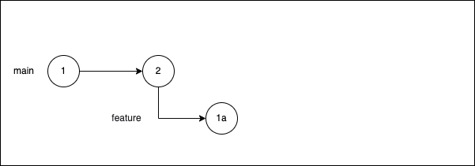

# z/OS Pipeline Workflow

!!! note
    All commands in this page are for the **terminal**. Every operation you do here can be **done in iDZ** (IBM Developer for z/OS).  In addition, **be sure to read** the [Git and Github Concepts](../concepts/git-and-github.md) before proceeding.

### Reference material
This page refers to the `build.yml` pipeline configuration file.  Review the one you created for your pipeline.  The content below refers to the one in the  `zos-application-template` which yours was based off of.  Click [build.yml](https://github.ibm.com/cio-ci-cd/zos-application-template/blob/main/build.yml){target=\_blank} to open it in a separate browser tab.

### Workflow concepts
z/OS Git follows trunk-based development where there is a single `main` branch (aka default branch). Feature branches (non-default) are created from the default branch. Once approved and deployed, they are merged back into the `main` trunk.  Feature branches in trunk-based development is designed to be **short lived**.  CIO CI/CD has automatic and manual deployment processes for z/OS outlined in this page.

### Step 1: Create a new branch from the default branch

From your `main`, run `git checkout -b <feature>` where `<feature>` is the name of the new change you are making to your application. This creates a new branch called by that name, branching off from the latest code in `main` (2 in the diagram below).

### Step 2: Make code changes, commit and push

Edit some files for the feature you intend to build. Commit those files.  The "1a" circle below represents the commit.  The commit is the changes you made to code cut from the `main` branch.

The feature branch resides on your local copy of the repository.  By making this commit, you have not made any changes to github.ibm.com.  The push step synchronizes your changes from your computer to the github.ibm.com server.

For more how-to guidance on Git commit and push, see this page: [How to Commit and Push](#how-to-commit-and-push).

### Step 3: Open a Pull Request

 When you are ready for review and deployment, open a Pull Request (PR).

 

A PR is a web-based and configurable set of screens in Github that facilitates a manual review process of the code changes before merging them into production.  A minimum of one team member needs to manually review the changes. **You must set up** [Branch Protection Rules](../../branch-protection-rules.md) for this to work. When branch protection rules are configured properly, Github will automatically ask if you want to create a pull request based off a push.  You can push numerous changes before or after you create the request.  None of them will merge into `main`.

If you do not have [Branch Protection Rules](../../branch-protection-rules.md) in place for `main`, your code will automatically merged into `main` the same way it automatically merges into a feature branch.  It is OK to automatically merge code into the main copy of the feature branch on IBM Github because it is isolated to that branch.  Code that is merged into `main` must be correct because it is a candidate for production.

CIO CI/CD is configured to watch for push events on open PR's.  When you push your commit to github.ibm.com and you have created a PR, CIO CI/CD is triggered to take an action. CIO CI/CD analyzes the configuration in `build.yml` and looks for the `defaultEnvironment` parameter.  It builds the feature code and *automatically deploys* it to this environment corresponding to the value of `defaultEnvironment` for you to review.

!!! note
    When a PR is open, the push event triggers an automatic deployment only to the `defaultEnvironment`.  All other environments in the `build.yml` require manual deployment.

If you don't know how to open a PR, refer to this page on Github: [Creating the pull request](https://docs.github.com/en/pull-requests/collaborating-with-pull-requests/proposing-changes-to-your-work-with-pull-requests/creating-a-pull-request#creating-the-pull-request){target=\_blank}.

### Step 4: Wait for Build



### Step 5: Deploy after Approved

Refer back to your `build.yml`.  In the following example, we will be using the `zos-application-template` [build.yml](https://github.ibm.com/cio-ci-cd/zos-application-template/blob/main/build.yml){target=\_blank}.

To recap, when your PR is created, the pipeline checks if it is up to date and if so the feature is automatically built and deployed to the `defaultEnvironment` listed in your `build.yml`.  You can also push it manually to other pre-production environments using the release API steps below in this document.

Production adds the requirement that the PR must be approved.

Up to date means that no new changes exist in `main` *since* you created your branch.  If new changes do exist, you need to merge `main` into your feature branch using [these instructions from Git](https://git-scm.com/docs/git-merge){target=\_blank}.

Once you are satisfied with the testing in the pre-prod environments, approve the PR and manually deploy to production.  Verify the change in production, then return to Github and merge the PR for the feature branch into `main`.  This will merge all the code from the feature branch into production.

An example flow is the following (assuming `defaultEnvironment` in your build.xml equals `dev-env`):

1. Create the Feature Branch and make code changes.
1. Push the branch from your laptop to IBM Github.
1. Create a Pull Request and review the change in `dev-env` where it was automatically deployed.
1. Make any necessary additional changes.  On each push, they will be automatically deployed to `dev-env`.
1. Manually deploy the changes to `qa` for stakeholder review.
1. Upon successful stakeholder review, approve the PR and manually deploy to production.
1. Verify production.
1. Merge the PR.

!!! warning
    All of these deployments originate off of the PR for the feature branch.  You must manually merge the PR into `main` per [Step 6](#step-6-merge-branch-to-main) below after you have verified the production deployment.

#### Manual Deployment Steps:

1. Log into the IBM My Developer Portal: [https://cirrus.ibm.com/developer](https://cirrus.ibm.com/developer){target=\_blank}.
2. Click on your application on the landing page after login or move your cursor over the left navigation bar and choose your application. If you don't see your application, see the entry to resolve this in the FAQ section of on the resources page: [https://cirrus.ibm.com/developer/resources](https://cirrus.ibm.com/developer/resources){target=\_blank}.
3. On the Pipeline Metrics tab or the Deployments tab, click `Actions` in the top right and choose `Release`.
4. Enter the `Branch` name and `Target environment` and press `Release`.
5. Monitor your release on the `Deployments` tab.

The above steps triggers the pipeline to deploy the code on the `Branch` you specified to the `Environment` you specified.

### Step 6: Merge branch to main

When the deployment is confirmed to be working, merge the feature branch into`main`.

[I don't know how to merge a branch to main](https://docs.github.com/en/pull-requests/collaborating-with-pull-requests/incorporating-changes-from-a-pull-request/merging-a-pull-request#merging-a-pull-request){target=\_blank}

### Extra Tips

#### How to Commit and Push

1. You can run `git add .` to just commit all changes you've made. This stages the files to be committed. You can also `git add <path-to-file>` manually.

1. Then run `git commit -m "Your Commit Message That Describes What You Did"`.

1. Push your changes to GitHub with `git push`. You will need to set a upstream reference on the first push from your local to GitHub, i.e.
   `git push --set-upstream origin feature`

#### Retrieve Output logs after a CIO DevEx run

Currently, during the CIO DevEx's pipeline runs, a temporary folder is created on the targeted z/OS Machine for CI/CD purposes and it is automatically cleaned up at the end of every run.

In some cases, you may want to have a deep look at any generated log during the CI steps in order to debug compilation errors or investigate unexpected behaviors.

For debugging purposes, during the clean up process, CIO DevEx takes into consideration any output log which may contain valuable information when investigating unexpected behaviors:

1. Output logs generated during a pipeline run are automatically saved into a generated folder accessible at the following path: `/tmp/<-github-owner->/<-repo-name->/<-commit-sha->/` (e.g. /tmp/cio-ci-cd-test/zos-application/6b6bcce82efd06110f256364563fd3012263dca3/)
1. The dedicated folder named upon commit sha is present only when any log file was actually found and saved.

!!! Note
    CIO DexEv is currently not responsible for cleaning up the generated folders/files in the `/tmp` directory (which may cause disk space limits at any point), thus we encourage users to responsibly take care of any obsolete content.